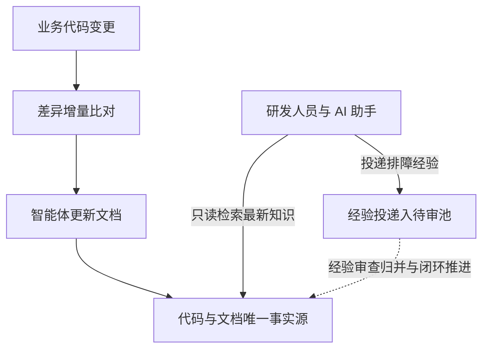

# knowledge-server

为 AI 智能体与研发团队打造的自维护工程知识中枢。

knowledge-server 是基于 ActionDock 构建的工程知识服务容器。通过代码变更自动驱动文档更新，将线上排障经验收集入待审池，统一由云端对外提供已同步的最新代码与知识检索。

---

## 解决的问题

在多智能体协作与高频迭代的研发场景中，传统工程知识库普遍面临三个现实问题：

- **文档与代码脱节**：业务代码高频重构，人工补文档成本高，文档很快就会落后于代码真实实现。
- **本地环境不一致**：本地代码仓未及时拉取主干时，智能体基于陈旧代码分析排障，容易得出错误结论。
- **排障经验难以沉淀**：线上排障踩坑经验散落在群聊中；若直接随意编写正式文档，又容易引发内容冲突与碎片化。

---

## 核心特性

- **代码驱动文档自维护**：代码变更自动驱动智能体核验差异并更新文档，告别人工补文档。
- **云端统一最新视界**：统一由云端服务提供实时同步的代码与文档基准，消灭本地滞后。
- **排障经验规范入池**：线上排障经验投递至独立待审池，经自动化核验提炼后归档，不污染正式知识库。
- **单端口多视图安全隔离**：在 443 端口基于 Token 自动隔离，外部只读与追加，内部特权维护。

---

## 业务流转流程



---

## 三分钟快速上手

### 配置环境与高强度鉴权令牌

复制环境配置模板并生成高强度随机令牌：

```bash
cp .env.example .env
openssl rand -hex 32
openssl rand -hex 32
```

编辑 `.env` 文件，分别填入生成的专属鉴权令牌与宿主机持久化目录：

```dotenv
ACTIONDOCK_TOKEN=<生成的首个高强度随机查询令牌>
ACTIONDOCK_AGENT_TOKEN=<生成的第二个高强度随机维护令牌>
PORT=443
KNOWLEDGE_DATA_DIR=/data/knowledge
SSH_DIR=/root/.ssh
```

### 容器编排一键启动

通过 Docker Compose 启动容器化服务：

```bash
docker compose up -d --build
```

服务统一监听 443 端口，内置自签名证书保障通信链路安全。

### 客户端验证检索与经验投递

在客户端添加查询与特权维护连接配置：

```bash
# 添加面向外部用户的检索与投递配置
ad profile add sk -s https://<cloud-host-ip>:443 -t <ACTIONDOCK_TOKEN> -k -d "知识库查询服务"

# 添加面向维护智能体的受控维护配置
ad profile add skm -s https://<cloud-host-ip>:443 -t <ACTIONDOCK_AGENT_TOKEN> -k -d "知识库维护服务"
```

验证工程代码全文检索与候选排障经验投递：

```bash
# 验证工程代码全文检索
ad run workspace/search.rg --profile sk -- pattern=createPayment

# 验证排障经验结构化投递至待审池
ad run knowledge/knowledge.collect --profile sk --input-file candidate.json
```

---

## 深入探索

关于系统的架构设计、部署实操、维护规程与自动化调度细节，请阅读以下技术文档：

- **架构设计与演进理念**：单端口多视图安全模型与闭环演进机制，请阅读 [docs/design.md](docs/design.md)。
- **部署与运维指南**：宿主机目录持久化规范、证书替换与容器健康检查，请阅读 [docs/deployment.md](docs/deployment.md)。
- **维护规程与动作参考**：维护智能体五步标准作业法与全量动作参数，请阅读 [docs/maintenance.md](docs/maintenance.md)。
- **流水线调度器手册**：多代码仓巡检调度、断点续传机制与看板配置，请阅读 [docs/pipeline-runner.md](docs/pipeline-runner.md)。
- **智能体编排技能规范**：总控编排智能体技能规范与任务流转规则，请阅读 [skills/knowledge-maintenance-orchestrator/SKILL.md](skills/knowledge-maintenance-orchestrator/SKILL.md)。

---

## 开源许可证

本项目遵循 MIT 开源许可证。
