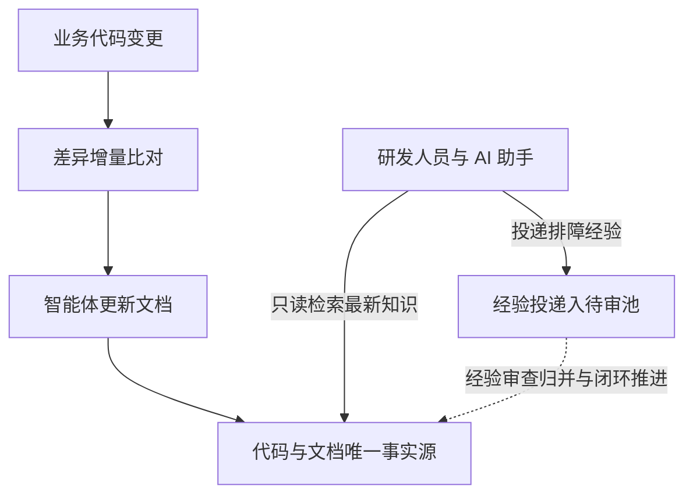

# knowledge-server

为 AI 智能体与研发团队打造的自维护工程知识中枢。

knowledge-server 是面向现代软件工程团队与 AI 智能体体系设计的自维护工程知识服务框架。框架围绕代码演进驱动文档自动化维护的核心理念，基于 ActionDock 单端口多视图架构统一收敛至 443 端口：对外通过动作级白名单提供只读检索与受控追加视界，对内为维护智能体提供自闭环的受控读写平面，从根源上终结工程知识滞后、碎片化与失真难题。

---

## 为什么需要它

在多智能体协作与高频迭代的研发场景中，传统工程知识库普遍面临三大现实痛点：

- **文档写完即过时，智能体幻觉频发**：业务代码高频变动，人工维护文档成本极高，往往写完即脱节；智能体读取陈旧文档后产生严重幻觉，直接误导技术决策。
- **本地代码滞后，排障分析全靠盲猜**：开发者与本地 AI 助手往往未拉取最新生产分支代码，基于本地残缺基线排障极易产生严重决策偏差。
- **排障经验沉底流失，直接写文档易引冲突**：线上排障踩坑经验沉在群聊中无法系统沉淀，下次遇到重复踩坑；若直接开放正式文档随意编写，又极易导致知识资产碎片化与版本冲突。

---

## 它能为你做什么

- **代码驱动文档自维护**：代码变更自动驱动智能体执行差异比对与文档自维护，告别人工补文档。
- **云端最新权威视界**：统一由云端服务提供实时同步的代码与文档基准，消灭本地滞后，保障协同决策基于唯一权威事实源。
- **排障经验规范沉淀入待审池**：线上排障经验规范投递至独立待审池，经自动化核验与周期归并闭环，不污染正式知识库。
- **开箱即用的多租户安全隔离**：原生单端口虚拟视图隔离，外部用户仅开放只读检索与受控追加，内部智能体享有完整特权维护能力。

---

## 它是如何工作的



系统严格确立 Git 代码仓为唯一事实源。业务代码变更自动驱动差异比对与文档自维护；外部请求统一经由 443 单端口多视图鉴权路由，查询端获取权威知识，排障经验投递至待审池，最终由维护流程闭环吸收入正式文档资产。

---

## 三分钟快速上手

### 配置环境与高强度鉴权令牌

复制环境配置模板并生成高强度随机令牌：

```bash
cp .env.example .env
openssl rand -hex 32
openssl rand -hex 32
```

编辑 `.env` 文件，分别填入生成的专属鉴权令牌与宿主机持久化目录：

```dotenv
ACTIONDOCK_TOKEN=<生成的首个高强度随机查询令牌>
ACTIONDOCK_AGENT_TOKEN=<生成的第二个高强度随机维护令牌>
PORT=443
KNOWLEDGE_DATA_DIR=/data/knowledge
SSH_DIR=/root/.ssh
```

### 容器编排一键启动

通过 Docker Compose 启动容器化服务：

```bash
docker compose up -d --build
```

服务统一监听 443 端口，内置自签名证书保障通信链路安全。

### 客户端验证检索与经验投递

在客户端添加查询与特权维护连接配置：

```bash
# 添加面向外部用户的检索与投递配置
ad profile add sk -s https://<cloud-host-ip>:443 -t <ACTIONDOCK_TOKEN> -k -d "知识库查询服务"

# 添加面向维护智能体的受控维护配置
ad profile add skm -s https://<cloud-host-ip>:443 -t <ACTIONDOCK_AGENT_TOKEN> -k -d "知识库维护服务"
```

验证工程代码全文检索与候选排障经验投递：

```bash
# 验证工程代码全文检索
ad run workspace/search.rg --profile sk -- pattern=createPayment

# 验证排障经验结构化投递至待审池
ad run knowledge/knowledge.collect --profile sk --input-file candidate.json
```

---

## 深入探索

关于系统的架构设计、部署实操、维护规程与自动化调度细节，请阅读以下技术文档：

- **架构设计与演进理念**：单端口多视图安全模型与闭环演进机制，请阅读 [docs/design.md](docs/design.md)。
- **部署与运维指南**：宿主机目录持久化规范、证书替换与容器健康检查，请阅读 [docs/deployment.md](docs/deployment.md)。
- **维护规程与动作参考**：维护智能体五步标准作业法与全量动作参数，请阅读 [docs/maintenance.md](docs/maintenance.md)。
- **流水线调度器手册**：多代码仓巡检调度、断点续传机制与看板配置，请阅读 [docs/pipeline-runner.md](docs/pipeline-runner.md)。
- **智能体编排技能规范**：总控编排智能体技能规范与任务流转规则，请阅读 [skills/knowledge-maintenance-orchestrator/SKILL.md](skills/knowledge-maintenance-orchestrator/SKILL.md)。

---

## 开源许可证

本项目遵循 MIT 开源许可证。
