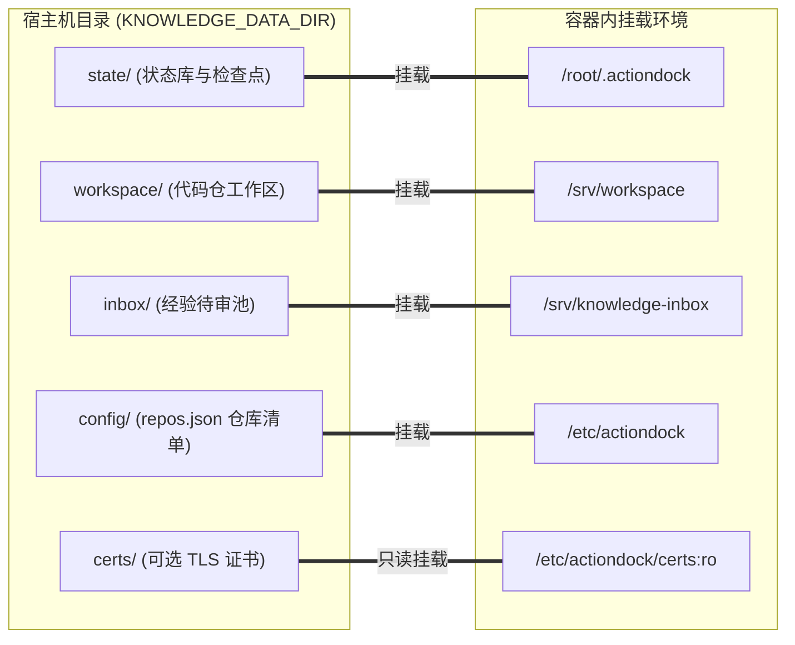

# 知识中枢部署与运维指南

---

## 概述

knowledge-server 是基于 ActionDock 规范构建的一体化知识服务容器。统一在 443 原生 HTTPS 端口运行，通过 Bearer Token 自动隔离查询视图（只读检索与候选投递）与维护视图（代码同步、编辑与检查点推进）。

---

## 环境准备

- **操作系统**：Linux（CentOS 7+、Ubuntu 20.04+、Debian 11+）。
- **容器环境**：Docker（大于等于 20.10）与 Docker Compose（大于等于 2.0）。
- **源码特性**：Monorepo 自包含架构，依赖本地装配，无需发布至 npm 源。
- **SSH 密钥**：宿主机需配置访问内部 Git 仓库的密钥（如 `~/.ssh/id_rsa`），容器启动时会自动修正权限（目录 700，私钥 600，自动接受主机指纹）。

---

## 持久化目录规划

所有持久化数据统一收敛于环境变量 `KNOWLEDGE_DATA_DIR`（默认为 `/data/knowledge`）。

```bash
mkdir -p /data/knowledge/{state,workspace,inbox,config,certs,logs,remotes}
```



### 目录职责一览

- **状态库目录** `state/`：
  - 挂载点：`/root/.actiondock`。
  - 用途：存放 ActionDock 运行状态与检查点数据库（`global.db` 与 `runtime.db`）。
  - 注意事项：此目录必须严格持久化。若丢失，容器重启后检查点归零，会误判为未初始化的新仓库并触发全量重头建库。
- **工作区目录** `workspace/`：
  - 挂载点：`/srv/workspace`。
  - 用途：存放待维护的代码仓。底层内置路径穿越拦截与软链校验。
- **经验待审池目录** `inbox/`：
  - 挂载点：`/srv/knowledge-inbox`。
  - 用途：存放排障人员投递的候选经验，与正式知识物理隔离。
- **配置文件目录** `config/`：
  - 挂载点：`/etc/actiondock`。
  - 用途：存放代码仓清单 `repos.json`。
- **证书目录** `certs/`：
  - 挂载点：`/etc/actiondock/certs:ro`。
  - 用途：放置正式 TLS 证书（`cert.pem` 与 `key.pem`）。若为空，启动时自动生成自签名证书。
- **日志目录** `logs/`：
  - 挂载点：`/var/log/actiondock`。
  - 用途：持久化服务与维护运行日志。
- **沙盒裸仓目录** `remotes/`：
  - 挂载点：`/data/knowledge/remotes`。
  - 用途：用于离线测试或本地沙盒演练。

---

## 环境变量配置

复制环境模板：

```bash
cp .env.example .env
```

生成两枚互不相同的高强度随机令牌（长度至少 32 字符）：

```bash
openssl rand -hex 32
openssl rand -hex 32
```

编辑 `.env`：

```dotenv
# 查询视图令牌 (只读检索与候选投递)
ACTIONDOCK_TOKEN=<填入第一个生成的 64 字符随机令牌>

# 维护视图特权令牌 (代码同步、编辑与检查点推进)
ACTIONDOCK_AGENT_TOKEN=<填入第二个生成的 64 字符随机令牌>

# 外部暴露端口
PORT=443

# 宿主机持久化根目录
KNOWLEDGE_DATA_DIR=/data/knowledge

# 宿主机 SSH 密钥目录
SSH_DIR=/root/.ssh
```

---

## 待维护仓库清单 (`repos.json`)

在 `$KNOWLEDGE_DATA_DIR/config/repos.json` 中配置纳管仓库：

```json
[
  {
    "path": "/srv/workspace/order-service",
    "repoType": "code",
    "sourceBranch": "release",
    "knowledgeBranch": "docs"
  },
  {
    "path": "/srv/workspace/system-knowledge",
    "repoType": "system_knowledge",
    "sourceBranch": "master"
  }
]
```

字段说明：
- `path`：仓库在容器内的绝对路径。
- `repoType`：`code`（业务代码仓，双分支治理）或 `system_knowledge`（系统级知识仓，单分支）。
- `sourceBranch`：主干代码分支。
- `knowledgeBranch`：知识分支（仅对 `code` 类型生效）。

---

## 启动与验证

### 启动容器

```bash
# 构建并后台启动
docker compose up -d --build

# 查看实时日志
docker compose logs -f
```

### 客户端连接验证

```bash
# 添加查询配置 (统一端口 443)
ad profile add sk -s https://<cloud-host-ip>:443 -t <ACTIONDOCK_TOKEN> -k -d "知识库查询服务"

# 验证全文检索
ad run workspace/search.rg --profile sk -- pattern=createPayment

# 验证排障经验投递
ad run knowledge/knowledge.collect --profile sk --input-file candidate.json
```

---

## 常用运维与排障速查

### 常用容器命令

```bash
# 查看容器状态
docker compose ps

# 进入容器调试
docker compose exec knowledge-server bash

# 重启容器服务
docker compose restart
```

### 常见问题排查

- **Git 分支拉取或推送失败（权限拒绝）**：
  - 检查宿主机 `~/.ssh/` 下私钥是否具备仓库读写权限。
  - 容器内执行 `docker compose exec knowledge-server ssh -T git@<git-host>` 测试连通性。
- **服务无法访问（端口超时）**：
  - 检查宿主机防火墙与云厂商安全组是否放行 443 端口。
  - 若 443 端口被占用，可在 `.env` 中修改 `PORT=8443` 并重启。
- **客户端提示证书不受信任**：
  - 使用自签名证书时，ActionDock 命令需带 `-k` 参数。
  - 若使用正式证书，将 `cert.pem` 与 `key.pem` 放置在 `$KNOWLEDGE_DATA_DIR/certs/` 目录下后重启容器。
