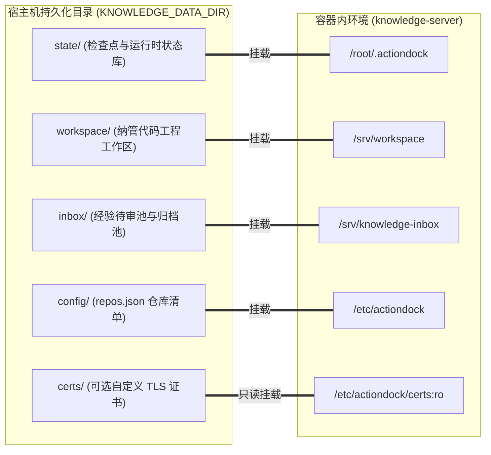

# 知识中枢部署与运维手册

---

## 部署目标与极简架构

knowledge-server 基于 ActionDock 框架构建，是一体化知识服务容器。本系统专为云主机与容器化环境设计，以运维人员与系统搭建者的生产诉求为核心，追求架构极简、运维透明、高内聚与防御纵深。

- **一体化容器交付**：
  - 将检索网关、权限隔离引擎、工作区操作工具链、排障经验待审池以及代码与文档维护智能体能力完整封装于单一容器镜像内。
  - 避免传统多微服务部署中微服务编排冗余、组件版本不一致与网络拓扑复杂的运维包袱，实现单一单元交付与原子化生命周期管理。
- **原生单端口多视图架构**：
  - 传统方案常在宿主机上开放多个端口分别提供查询、管理与调试能力，极易导致防火墙策略配置繁琐、网络端口暴露面过大以及内网访问策略失控。
  - 本系统基于 ActionDock 虚拟视图特性，统一在单一 443 端口上对外提供安全的 HTTPS 服务。
  - 网关依据请求头中的 Bearer Token 自动进行身份识别与虚拟视图路由分发：
    - 面向外部查询用户（持有查询令牌），通过动作级白名单严格收敛为只读检索与受控追加视图（sk 视图），开放全文检索、文件读取、目录列表与经验收集动作，坚决阻断任何写操作与维护动作。
    - 面向内部维护智能体（持有维护特权令牌），提供具备完整工程读写、受控局部编辑、差异审查与检查点推进能力的受控维护视图（skm 视图）。
- **单根目录持久化收敛**：
  - 系统所有数据、状态、工作区工程、待审经验、配置文件、证书与日志资产，全部统一收敛在宿主机单一根目录下。
  - 杜绝多目录散落各处导致的备份遗漏与灾备迁移困难，容器本身保持无状态，所有状态资产在宿主机单一根目录下闭环管理。
- **开箱即用的自动化自举网络**：
  - 容器内部采用轻量自举网络，内置反向代理网关与 ActionDock 守护进程协同工作。
  - 容器启动入口脚本自动检测并生成 TLS 证书，自动校验修正 SSH 密钥权限，自动发现并注册本地工具包路由，仅需一条命令即可完成拉起并对外服务。

---

## 环境准备与机器配置

在正式部署服务前，需确保宿主机与基础设施满足以下系统与软件环境依赖：

- **操作系统与内核要求**：
  - 支持主流 Linux 企业级发行版，例如 CentOS 7 及以上、Ubuntu 20.04 及以上、Debian 11 及以上、Rocky Linux 8 及以上。
  - 内核版本要求支持容器虚拟化技术、轻量安全命名空间隔离与标准文件系统特性。
  - 推荐机器规格：生产环境建议分配 2 核 CPU 与 4G 内存及以上；磁盘空间根据纳管工程代码仓与历史快照规模按需规划。
- **容器与编排工具链要求**：
  - 宿主机已安装 Docker 引擎，版本要求大于等于 20.10。
  - 宿主机已安装 Docker Compose 工具，版本要求大于等于 2.0。
  - 部署与运维执行用户必须具备调用 Docker 守护进程的完整特权，或已加入宿主机的 docker 用户组。
- **自包含 Monorepo 无需外部发布 npm**：
  - 本项目采用自包含 Monorepo 架构组织，所有核心功能包均内置在工程源码目录中：
    - 工作区能力包 `packages/knowledge-workspace`：负责工作区工程代码与知识文档的全文检索、文件分段直读、目录浏览、安全写入、受控局部编辑、文件移动删除、工作区状态审查与断链校验。
    - 经验追加平面包 `packages/knowledge-inbox`：负责收集人工排障与日常运维产生的结构化候选文档并写入待审池，以及后续审核归档。
    - 特权维护平面包 `packages/knowledge-maintenance`：负责双分支代码同步、差异提交扫描、文档发布提交与检查点水位推进。
  - 源码结构具备完全自包含特性，各子包无需预先构建或发布至外部公共或私有 npm 镜像源，在容器构建阶段直接由 Dockerfile 本地装配依赖、安装生产运行时并在启动时自动建立全局路由软链，彻底摆脱对外部包管理仓库的运行时网络依赖。
- **SSH 凭据挂载与自动权限修正机制**：
  - 宿主机需配置具备访问内部代码托管平台的 SSH 密钥对，默认存放在宿主机的 `~/.ssh/` 或 `/root/.ssh/` 目录下。
  - 该密钥对用于在维护流程中免密拉取业务分支代码并向知识分支推送文档产物。
  - 容器启动入口脚本包含强制性权限防御与自动修正机制：
    - 自动检测挂载的 SSH 目录，将其目录权限强制修正为 700。
    - 自动检测私钥文件（`id_*`），将其文件权限强制修正为 600，杜绝因宿主机权限过于宽泛导致 SSH 客户端拒绝加载私钥。
    - 自动在配置文件中写入主机指纹接受策略（`StrictHostKeyChecking accept-new`），彻底消除自动化流程中因首次连接 Git 托管平台弹出确认交互而导致流程阻塞超时的问题。

---

## 宿主机持久化目录架构与灾难预防

为确保容器在销毁、重建、镜像升级或跨机迁移过程中所有核心数据与运行状态完整留存，系统通过统一的环境变量收敛宿主机持久化存储路径。

- **根目录收敛原则**：
  - 持久化根目录由环境变量 `KNOWLEDGE_DATA_DIR` 统一指定，未显式配置时默认使用 `/data/knowledge`。
  - 严禁将数据资产分散放置在不同路径，运维人员仅需对该单一根目录制定定时备份与快照策略即可保障全系统资产安全。
- **宿主机目录初始化命令**：
  ```bash
  mkdir -p /data/knowledge/{state,workspace,inbox,config,certs,logs,remotes}
  ```


- **各子目录职责、挂载点与灾难预防详解**：
  - **状态库子目录** `state/`：
    - 宿主机路径：`${KNOWLEDGE_DATA_DIR}/state`
    - 容器挂载点：`/root/.actiondock`
    - 职责定位：存放 ActionDock 框架底层运行时状态数据库，包含 SQLite 状态库文件。核心记录各纳管代码仓库的检查点水位、全局配置与任务执行指标。检查点记录是维护智能体执行增量核验与断点续传的单一事实源依据。
    - 场景化灾难说明：若 `state/` 目录未持久化或意外丢失，容器一旦重启，所有纳管代码仓的历史检查点水位将直接归零。维护智能体在执行代码与知识核验时，将无法获知历史上一次已经完成核验的代码提交哈希，被迫退化为全量回溯扫描。这将引发灾难性的全量重复建库，瞬间消耗极高的 CPU 算力与 Git 远程带宽，更可能因为大规模覆盖而产生严重的合并冲突与知识污染，运维人员必须对该目录施加最高优先级的备份保护。
  - **工作区代码仓子目录** `workspace/`：
    - 宿主机路径：`${KNOWLEDGE_DATA_DIR}/workspace`
    - 容器挂载点：`/srv/workspace`
    - 职责定位：存放所有待维护的业务工程代码仓与系统级知识仓。由运维人员预先克隆或由维护工具执行拉取。维护智能体在容器内部在此目录下进行代码阅读、分支拉取、差异扫描、文档增删改与提交推送。
    - 场景化灾难说明与路径穿越防护：工作区直接承载代码实体。若缺乏严格边界校验，外部恶意请求可能通过路径穿越符号（例如父目录导航字符）或恶意软链逃逸越权读取甚至破坏宿主机核心系统资产。knowledge-server 底层工具链对所有输入路径执行强约束规范化解析与真实物理路径校验，严密锁定操作范围仅限工作区内部，坚决阻断任何跨目录逃逸与符号链接越界。若该目录丢失，虽可通过远程仓库重新克隆恢复，但未提交的本地临时草稿和工作区缓存将彻底丢失。
  - **待审经验池子目录** `inbox/`：
    - 宿主机路径：`${KNOWLEDGE_DATA_DIR}/inbox`
    - 容器挂载点：`/srv/knowledge-inbox`
    - 职责定位：持久化由排障智能体、运维人员或外部调用方投递的结构化候选文档资产。其内部划分用于存放待处理文档的待审池以及处理完毕后的归档池。
    - 场景化灾难说明与物理隔离价值：生产环境中排障记录与人工故障处理经验往往具有时效性、非结构化或存在部分事实偏差。若允许外部排障工具直接写入正式代码仓或正式知识分支，极易造成未经验证的推断污染权威知识库，甚至引发误导性操作。通过设立独立的物理目录与独立包能力，实现了候选经验贡献单元与正式知识单元的强物理隔离，必须经过维护流程的显式审阅与萃取方可归档并合入正式分支。若该目录丢失，将导致尚未流转审阅的宝贵排障经验遗失。
  - **配置子目录** `config/`：
    - 宿主机路径：`${KNOWLEDGE_DATA_DIR}/config`
    - 容器挂载点：`/etc/actiondock`
    - 职责定位：存放仓库清单配置文件 `repos.json`。该文件定义了系统纳管的所有代码仓库绝对路径、仓库类型、源分支与知识分支映射策略。
    - 场景化灾难说明：若配置文件损坏或丢失，系统将退化至目录扫描兜底机制，可能推断出默认分支策略，若业务仓并非使用标准 `release` 与 `docs` 分支，可能导致分支同步目标偏离。
  - **证书子目录** `certs/`：
    - 宿主机路径：`${KNOWLEDGE_DATA_DIR}/certs`
    - 容器挂载点：`/etc/actiondock/certs:ro`（只读挂载）
    - 职责定位：用于存放权威机构或企业内部机构签发的正式 TLS 证书公钥 `cert.pem` 与私钥 `key.pem`。容器启动时优先加载该目录下的正式证书。
    - 场景化灾难说明：采用只读挂载防护，避免容器内进程因异常或漏洞篡改宿主机私钥文件。若证书文件缺失，服务将自动生成临时自签名证书保障加密传输，但可能导致外部严格校验 CA 链的客户端出现阻断报警。
  - **日志子目录** `logs/`：
    - 宿主机路径：`${KNOWLEDGE_DATA_DIR}/logs`
    - 容器挂载点：`/var/log/actiondock`
    - 职责定位：持久化容器服务的运行日志、网关访问审计日志与维护任务执行日志。便于结合宿主机的日志采集框架统一收拢与审计。
    - 场景化灾难说明：日志是生产审计与排障溯源的生命线。若未挂载持久化，容器重启或崩溃后故障现场即刻消失，无法追溯恶意调用或系统异常根因。
  - **远程沙盒裸仓子目录** `remotes/`：
    - 宿主机路径：`${KNOWLEDGE_DATA_DIR}/remotes`
    - 容器挂载点：`/data/knowledge/remotes`
    - 职责定位：用于在本地演练、断网沙盒测试或集成验证场景下存放本地 Git 裸仓。
    - 场景化灾难说明：用于将测试环境与生产真实远程仓库彻底解耦，避免在演练与调试过程中误推脏数据至外部生产代码仓库。

---

## 环境变量配置指引

系统在工程根目录下通过环境配置文件 `.env` 管理所有核心参数。部署时通过模板文件进行初始化：

```bash
cp .env.example .env
```

- **核心环境变量详细语义**：
  - **配置参数** `PORT`：
    - 作用范围：外部访问统一监听端口。
    - 默认数值：`443`。
    - 详细说明：系统基于原生单端口多视图模式运行，对外仅暴露该单一端口提供 HTTPS 服务。外部网络防火墙与安全组只需放通此端口，无需针对查询与维护分别开放不同端口。
  - **配置参数** `ACTIONDOCK_TOKEN`：
    - 作用范围：面向外部查询用户的检索与追加令牌。
    - 权限约束：对应系统中的只读检索与受控追加视图（sk 视图）。持有该令牌的客户端仅被允许调用动作级白名单中的动作：`workspace/search.rg`、`workspace/files.read`、`workspace/files.list` 以及 `knowledge/knowledge.collect`。网关严格阻断任何文件写操作、文件移动删除以及特权维护动作。
  - **配置参数** `ACTIONDOCK_AGENT_TOKEN`：
    - 作用范围：面向内部维护智能体的受控维护令牌。
    - 权限约束：对应系统中的受控维护视图（skm 视图）。持有该令牌的客户端允许访问 `workspace`、`knowledge`、`maintenance` 三大受控包内的所有能力，包括工作区读写、受控局部编辑、差异比对、代码与分支同步、文档发布提交与检查点推进。
  - **配置参数** `KNOWLEDGE_DATA_DIR`：
    - 作用范围：宿主机持久化数据根目录路径。
    - 默认数值：`/data/knowledge`。
    - 详细说明：上述所有持久化子目录均基于此路径自动衍生挂载，保证数据集中收敛。
  - **配置参数** `SSH_DIR`：
    - 作用范围：宿主机 SSH 凭据目录路径。
    - 默认数值：`/root/.ssh`。
    - 详细说明：以只读模式挂载至容器内部，为内部 Git 工具链提供免密访问凭据。
- **双令牌生成方法与强制安全要求**：
  - **高强度随机密钥生成命令**：
    管理员必须在终端中分别执行两次加密随机数生成命令，分别获取两个完全独立的十六进制随机字符串：
    ```bash
    openssl rand -hex 32
    openssl rand -hex 32
    ```
    每次命令将输出包含 64 个字符的强随机字符串，分别填入 `.env` 中的 `ACTIONDOCK_TOKEN` 与 `ACTIONDOCK_AGENT_TOKEN`。
  - **网关强约束安全防御校验**：
    容器自举脚本与虚拟视图网关内置了多道防御校验，一旦违反以下任一安全规则，容器启动立即失败并中断退出：
    - 存在性校验：`ACTIONDOCK_TOKEN` 与 `ACTIONDOCK_AGENT_TOKEN` 均不能为空，必须显式定义。
    - 长度下限校验：两个令牌的字符长度必须均大于或等于 32 字符，拒绝使用弱口令。
    - 互斥性校验：`ACTIONDOCK_TOKEN` 与 `ACTIONDOCK_AGENT_TOKEN` 绝对不可相同。若两项配置一致，系统判定为权限隔离失效并立即阻断退出。
    - 占位符拦截校验：网关内置已知公开占位符签名库。若配置中包含模板占位符特征字符串（如 `4f8c9b`、`e7a1d2`、`9f83b2a7`、`8a12d4e7`、`your-random-secure` 等），将直接判定为不安全配置并拒绝启动。

---

## 待维护代码仓清单配置

知识中枢通过配置文件精确获知纳管的代码仓库列表及其分支维护策略。

- **配置文件路径规范**：
  - 宿主机文件绝对路径为 `${KNOWLEDGE_DATA_DIR}/config/repos.json`（对应容器内挂载路径为 `/etc/actiondock/repos.json`）。
  - 该配置文件采用标准 JSON 数组格式，每一项代表一个受控维护的代码仓库或系统知识仓库。
- **字段语义与定义规范**：
  - **字段** `path`：
    - 必须为容器内部的绝对路径，格式固定为 `/srv/workspace/<仓库目录名称>`。
    - 路径必须严格收敛在工作区根目录 `/srv/workspace` 内，底层维护工具在调用时执行软链穿透与真实物理路径校验，严禁指向工作区外部目录。
  - **字段** `repoType`：
    - 仓库类型标识，枚举值仅允许为 `code` 或 `system_knowledge`。
    - `code`：表示业务代码仓库。该类仓库业务代码迭代频繁，采用双分支演进规范。
    - `system_knowledge`：表示系统级知识仓库。该类仓库不包含业务代码，用于统一沉淀跨业务的全局架构与规范文档，采用单分支主干规范。
  - **字段** `sourceBranch`：
    - 源码事实源分支名称。
    - 在业务代码仓中通常为生产发布基线分支，如 `release` 或 `master`。知识维护智能体从此分支拉取最新业务代码提交。
    - 在系统级知识仓中为知识沉淀的主干分支，通常为 `master` 或 `main`。
  - **字段** `knowledgeBranch`：
    - 知识文档沉淀分支名称。
    - 该字段仅在 `repoType` 为 `code` 时生效且必填，行业规范通常命名为 `docs`。
    - 当 `repoType` 为 `system_knowledge` 时，该字段不生效，配置时直接省略即可。
- **标准配置示例**：
  ```json
  [
    {
      "path": "/srv/workspace/order-service",
      "repoType": "code",
      "sourceBranch": "release",
      "knowledgeBranch": "docs"
    },
    {
      "path": "/srv/workspace/cron-service",
      "repoType": "code",
      "sourceBranch": "release",
      "knowledgeBranch": "docs"
    },
    {
      "path": "/srv/workspace/system-knowledge",
      "repoType": "system_knowledge",
      "sourceBranch": "master"
    }
  ]
  ```
- **业务代码仓双分支演进规范**：
  - 业务代码仓严格贯彻双分支解耦设计，将生产业务迭代与文档资产演进隔离开来：
    - 事实源分支（`sourceBranch`，如 `release`）：由业务研发团队持续集成交付，作为业务逻辑的唯一代码事实源。维护智能体对此分支仅执行只读拉取，严禁在此分支上提交任何文档。
    - 知识沉淀分支（`knowledgeBranch`，如 `docs`）：由维护智能体专属维护。智能体周期性唤起，将 `sourceBranch` 的增量提交拉取并合并至 `knowledgeBranch`。
    - 双轨合并冲突消解策略：代码合并过程中，若发生非知识文档的源代码冲突，系统默认无条件采用生产分支代码覆盖，确保代码资产自动对齐且流水线不中断；若发生知识文档本身的文字冲突，系统保留冲突标记并由维护智能体进行语义化比对和消解，消解完成后通过标准发布动作提交并推送到远端知识分支。
    - 规范文档结构：在知识分支中，知识文档统一按标准目录组织，包含业务流程、架构模块、规则约束、接口契约、数据定义与运维手册等分类，杜绝在根目录下随意乱放散乱文件。
- **系统级知识仓单分支规范**：
  - 系统级知识仓（`repoType: "system_knowledge"`）主要承载全局性、跨系统架构知识与宏观技术资产。
  - 由于该仓库本身不包含可执行业务代码，无须进行业务代码与文档分支的隔离，采用单分支主干模式（如 `master`）。
  - 维护智能体在执行维护闭环时，直接在主干分支上执行同步、内容审计、链接校验与发布提交。
- **缺失配置文件时的自动发现兜底机制**：
  - 若初次部署时未手动创建 `repos.json` 文件，维护工具包内置了自动发现与配置生成逻辑。
  - 当检测到 `/etc/actiondock/repos.json` 不存在时，系统自动扫描工作区根目录 `/srv/workspace` 下的所有一级子目录。
  - 若子目录包含 `.git` 目录，系统根据目录名称特征进行模式推断：名称包含 `system-knowledge` 或 `knowledge-system` 的目录自动标记为 `system_knowledge` 并配置主分支；其余目录自动标记为 `code` 业务代码仓，默认配置源分支为 `release`，知识分支为 `docs`。
  - 扫描完成后自动生成标准格式的 `repos.json` 文件并持久化落盘，大幅降低初始化配置成本。

---

## 容器启动与验证

完成环境变量与代码仓清单配置后，即可执行容器构建与服务启动。

- **构建与后台拉起命令**：
  在工程根目录下执行构建与启动：
  ```bash
  docker compose up -d --build
  ```
  该命令将驱动 Dockerfile 完成以下自动化阶段：
  - 基于轻量级 Node.js 基础镜像安装底层工具链，包括支持部分克隆特性的 Git、全局高速搜索工具 ripgrep、SSH 客户端以及系统根证书。
  - 配置 Git 全局安全目录与维护者基础身份，防止多用户挂载卷引发权限归属异常拦截。
  - 全局安装 ActionDock 运行时客户端。
  - 拷贝项目源码并安装 Monorepo 生产依赖，将工作区平面、追加平面与特权维护平面三大工具包自动软链至 ActionDock 全局路由。
  - 启动容器入口自举脚本，完成 SSH 密钥目录权限校验修正、运行时工作区参数设定，并前台拉起单端口多视图反向代理服务。
- **传输层加密机制与证书策略**：
  - 服务在 443 端口上强制启用原生 HTTPS 加密传输，杜绝明文传输凭据风险。
  - **加载自定义正式证书**：
    若具备企业域名正式证书，仅需将证书文件与私钥文件分别命名为 `cert.pem` 与 `key.pem`，存放在宿主机 `${KNOWLEDGE_DATA_DIR}/certs/` 目录下。容器挂载该目录后，服务在初始化阶段将自动读取并加载该证书。
  - **自动生成自签名证书**：
    若未挂载自定义证书，服务检测到证书文件缺失时，会自动通过 openssl 在临时目录生成 2048 位 RSA 自签名 TLS 证书。控制台输出对应提示并以自签名证书正常对外提供 HTTPS 服务，保证测试与内部环境下开箱即用且全程加密。
- **服务健康与运行状态验证**：
  - **检查容器状态**：
    执行以下命令确认容器状态为运行中：
    ```bash
    docker compose ps
    ```
  - **查看容器启动日志**：
    ```bash
    docker compose logs -f
    ```
    确认日志中输出服务就绪信息，包含原生 HTTPS 端口监听状态、sk 视图启用状态、skm 视图启用状态以及各工作区根路径挂载信息。
- **客户端连接与单端口多视图隔离验证**：
  在客户端机器上安装 ActionDock 命令行工具，通过添加配置方案验证视图隔离效果：
  - **配置客户端连接配置文件**：
    ```bash
    # 添加面向外部查询用户的检索配置 (统一端口 443，携带 ACTIONDOCK_TOKEN)
    ad profile add sk -s https://<云主机IP>:443 -t <ACTIONDOCK_TOKEN> -k -d "知识库查询服务"

    # 添加面向维护智能体的特权维护配置 (统一端口 443，携带 ACTIONDOCK_AGENT_TOKEN)
    ad profile add skm -s https://<云主机IP>:443 -t <ACTIONDOCK_AGENT_TOKEN> -k -d "知识库维护服务"
    ```
    *(注：命令行参数 `-k` 用于在自签名证书环境下跳过证书链校验)*
  - **验证 sk 视图白名单收敛**：
    执行白名单动作应正常返回结果：
    ```bash
    ad run workspace/search.rg --profile sk -- pattern=test
    ad run workspace/files.list --profile sk -- path=order-service
    ```
    尝试执行写操作或维护动作，网关应坚决返回 403 阻断拒绝错误：
    ```bash
    ad run workspace/files.write --profile sk -- path=order-service/README.md content="hack"
    # 预期响应：HTTP 403 权限拒绝
    ```
  - **验证 skm 视图特权维护能力**：
    使用维护配置方案执行自省与只读扫描，应正常返回所有维护包与动作详情：
    ```bash
    # 查看可用动作列表
    ad list --profile skm

    # 执行全量分支同步扫描
    ad run maintenance/maintenance.list --profile skm
    ```

---

## 生产运维排障与高频场景自查

在知识中枢日常运维与故障排查过程中，可通过以下标准化命令完成容器基础运维与高频场景自查。

- **日常运维与调试命令集**：
  - **查看容器运行状态**：
    ```bash
    docker compose ps
    ```
  - **流式追踪实时日志**：
    ```bash
    # 追踪全量实时日志
    docker compose logs -f

    # 查看最近 100 行日志并流式追踪
    docker compose logs --tail=100 -f
    ```
  - **进入容器终端调试**：
    ```bash
    docker compose exec knowledge-server bash
    ```
  - **容器内验证 Git 免密连接连通性**：
    ```bash
    docker compose exec knowledge-server ssh -T git@github.com
    ```
  - **服务重启与平滑重新拉起**：
    ```bash
    # 重启容器服务
    docker compose restart

    # 停止服务
    docker compose stop

    # 重新构建并平滑拉起服务
    docker compose down && docker compose up -d --build
    ```
- **高频场景排障自查指引**：
  - **场景一：Git 凭证报错（Host key verification failed 或 Permission denied）**：
    - **排查根因**：宿主机 SSH 目录未正确挂载、私钥权限不符合要求、私钥未加入目标代码托管平台允许列表，或宿主机未配置目标服务器的主机指纹。
    - **处理方案**：
      - 检查宿主机 `${SSH_DIR}` 目录下是否存在匹配的私钥文件，确认私钥具有目标代码仓的读写权限。
      - 进入容器执行 `ssh -T git@<代码平台域名>` 进行手动连通性测试。
      - 检查容器内 `/root/.ssh/config` 是否包含 `StrictHostKeyChecking accept-new`，确保新主机连接时自动接受主机公钥指纹。
  - **场景二：宿主机端口占用冲突（address already in use）**：
    - **排查根因**：宿主机 443 端口已被原有的 Web 服务器（如 Nginx、Apache、Caddy 等）或其他容器服务占用。
    - **处理方案**：
      - 执行命令查看占用 443 端口的进程：`ss -tulpn | grep :443`。
      - 若宿主机已有反向代理服务，可在 `.env` 中修改暴露端口为其他端口，例如 `PORT=8443`。
      - 执行 `docker compose up -d` 重新加载端口映射，并在前端反向代理配置中将流量反向转发至知识中枢的新端口。
  - **场景三：客户端提示自签名证书不受信任或握手失败**：
    - **排查根因**：服务端使用自动生成的临时自签名证书，而客户端或调用方开启了严格的 CA 根证书链校验。
    - **处理方案**：
      - 在命令行客户端（如 curl 或 ActionDock 客户端）中临时使用 `-k` 或 `--insecure` 参数跳过证书链校验。
      - 生产环境中，强烈建议将权威机构签发的正式证书放入 `${KNOWLEDGE_DATA_DIR}/certs/` 目录下，并确保文件名为 `cert.pem` 与 `key.pem`。
      - 确保证书文件具备可读权限，执行 `docker compose restart` 重启服务，网关将在启动时自动切换为加载正式证书。
  - **场景四：网关响应 403 权限拒绝（ACTION_FORBIDDEN 或 PACKAGE_FORBIDDEN）**：
    - **排查根因**：客户端请求携带的 Bearer Token 错误，或者尝试在只读检索视图（sk 视图）中调用了受限动作。
    - **处理方案**：
      - 检查客户端请求头携带的 Token 是否与 `.env` 中的配置一致。
      - 确认调用意图：若需执行工程写入、编辑或分支同步等特权维护动作，客户端必须携带 `ACTIONDOCK_AGENT_TOKEN`。
      - 若使用外部只读检索工具，确认调用的动作是否属于白名单动作（`workspace/search.rg`、`workspace/files.read`、`workspace/files.list`、`knowledge/knowledge.collect`）。
  - **场景五：容器启动报安全错误并立即退出（SECURITY ERROR）**：
    - **排查根因**：`.env` 文件中未配置 Token、Token 字符长度不足 32 位、两个 Token 完全相同，或使用了公开示例占位符。
    - **处理方案**：
      - 检查容器启动日志：`docker compose logs`。
      - 重新执行命令生成两个全新的高强度随机令牌：`openssl rand -hex 32`。
      - 将生成的令牌分别填入 `.env` 中的 `ACTIONDOCK_TOKEN` 与 `ACTIONDOCK_AGENT_TOKEN`，确认两串字符互不相同且未包含示例特征。
      - 重新执行 `docker compose up -d` 启动容器。
