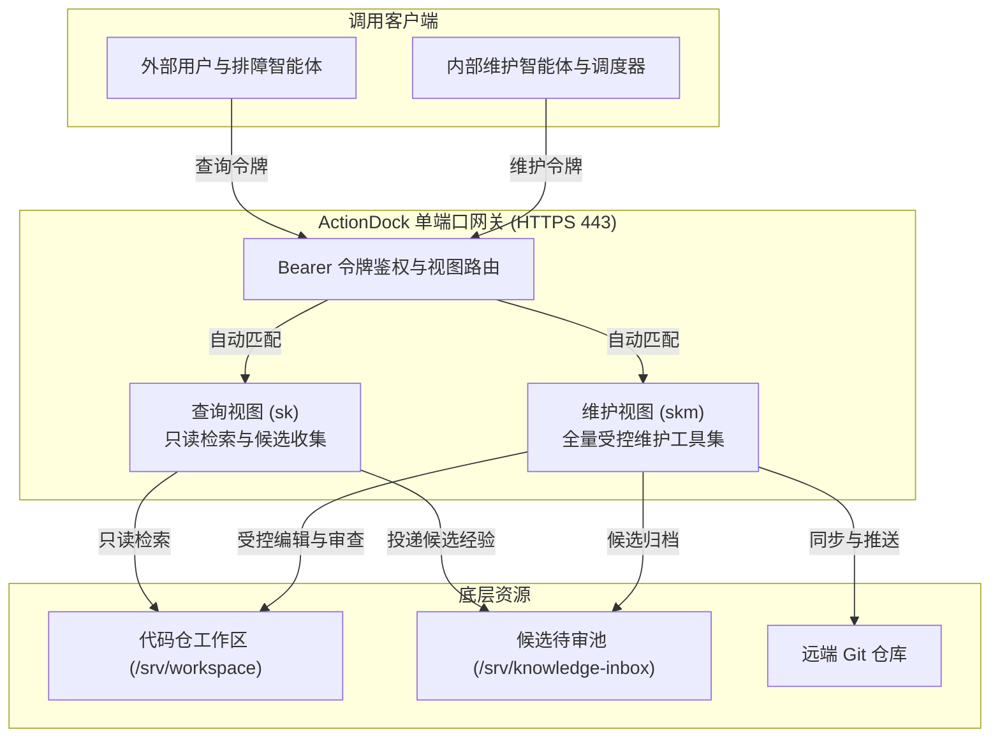
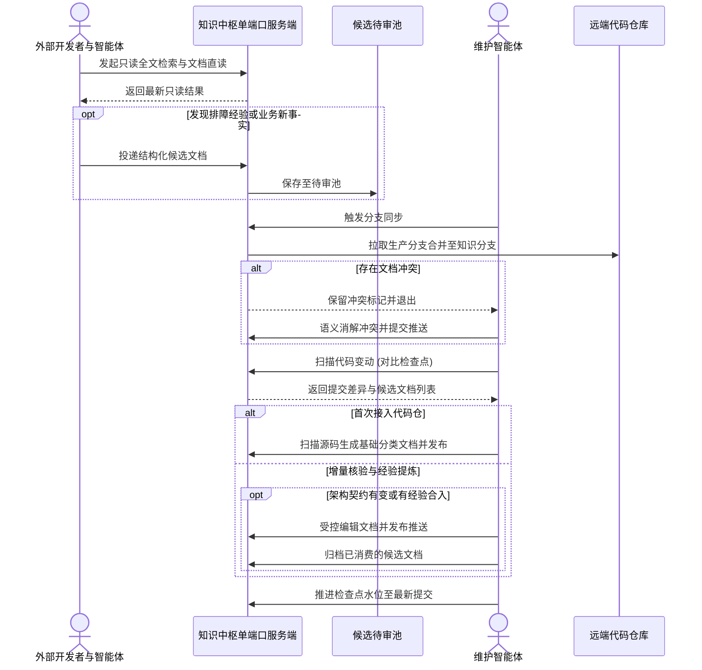

# 知识中枢架构设计理念

---

## 核心挑战与解决思路

在多智能体协同与高频迭代的工程场景下，知识库普遍面临三个问题：

- **文档与代码脱节**：业务代码高频迭代重构，手工维护文档成本高，文档从创建后便逐渐滞后于真实代码。
- **本地环境不一致**：本地代码仓未及时拉取主干时，智能体基于陈旧代码分析排障，容易得出错误结论。
- **排障经验难以沉淀**：线上的排障结论散落在群聊中，若直接随意写入正式文档，又会导致文档碎片化和冲突。

针对上述问题，系统采取以下设计原则：

- **代码即唯一事实源**：知识直接放在代码仓库中，与代码一同接受版本控制与审计。
- **云端提供统一只读视界**：外部查询统一请求云端中枢，确保获取的是已同步的最新事实。
- **双分支物理隔离**：主干分支放业务代码，专属分支（如 `docs`）放文档。业务代码冲突自动以主干为准，文档冲突由智能体语义消解。
- **检查点水位推进**：代码变更触发核验；无论文档最终是否变动，核验完成后均推进检查点，避免下次重复扫描已知提交。
- **贡献单元与知识单元解耦**：排障经验先进入候选待审池，经智能体去重提炼后再合入正式文档，保持正式知识的整洁。
- **单端口虚拟视图隔离**：443 单端口上根据 Token 自动路由，外部只读与追加，内部才能维护。
- **状态库持久化**：检查点状态保存于数据卷中，容器重启不丢基线。

---

## 核心设计推演

### 双分支模型与冲突处理

- **分支隔离**：主干代码分支负责生产发布，文档分支专门承载工程知识，两者物理隔离，互不污染提交历史。
- **代码冲突自动覆盖**：将生产分支合并至文档分支时，代码文件冲突一律无条件以生产分支为准，自动完成提交，防止代码差异阻塞维护流程。
- **文档冲突语义消解**：文档文件合并冲突时，脚本保留冲突标记并退出，交由维护智能体结合上下文消解冲突并重新提交。

### 检查点推进机制

- **为什么无改动也推进检查点**：代码改动不一定需要修改文档（如内部重构或注释调整）。审查确认无需改动后，推进检查点记录已核验水位，避免下次巡检重新扫描该区间，节约模型推理开销。

### 候选待审池与正式知识

- **待审池定位**：收集一线排障时的原始线索和临时结论，作为独立的贡献单元暂存，对外不提供直接检索。
- **正式知识提炼**：维护智能体定期消费待审池，去重提炼后增量更新到正式文档六大规范分类中，并归档候选文件，防止未审核信息污染知识库。

### 单端口多视图安全隔离

- **面向外部查询用户的检索视图**（视图标识 `sk`）：通过外部查询 Token 路由，仅开放只读检索与受控追加动作，底层未挂载任何写入工具，物理杜绝篡改。
- **面向内部维护智能体的受控维护视图**（视图标识 `skm`）：通过特权 Token 路由，提供完整工作区读写、编辑、审查与发布动作。

### 状态库持久化

- **为什么不能丢失**：ActionDock 的 `state/` 目录记录了每个仓库的检查点提交哈希。若丢失，容器重启后水位归零，会误判为未建库的新仓库，导致对所有仓库从头全量建库，消耗大量算力和带宽。

---

## 业务流转时序

---

## 核心特性对比

| 维度 | 传统手工 Wiki | 本地切片检索 | 知识中枢方案 |
|---|---|---|---|
| 事实源载体 | 独立第三方平台，与代码脱节 | 开发者本地磁盘与向量缓存 | Git 代码仓库，代码与文档统一版本管理 |
| 基准时效性 | 容易滞后，多为僵尸文档 | 受限于本地同步频率，易生幻觉 | 云端常态同步，提供最新统一事实 |
| 维护方式 | 纯靠人工自觉，容易遗漏 | 全量重新向量化，维护断续 | 代码变更自动驱动核验与检查点推进 |
| 冲突处理 | 人工覆盖或版本混乱 | 合并冲突直接报错中断 | 代码以生产为准自愈，文档由智能体语义消解 |
| 排障经验 | 散落在聊天记录中 | 容易混入偶发噪声 | 待审池缓冲，智能体提炼后入库 |
| 权限安全 | 粗粒度页面权限 | 本地脚本缺乏边界约束 | 单端口双视图，外部只读，内部特权 |
| 状态持久化 | 依赖外部平台 | 无状态或容易丢失 | 独立数据卷持久化检查点，支持断点续传 |
