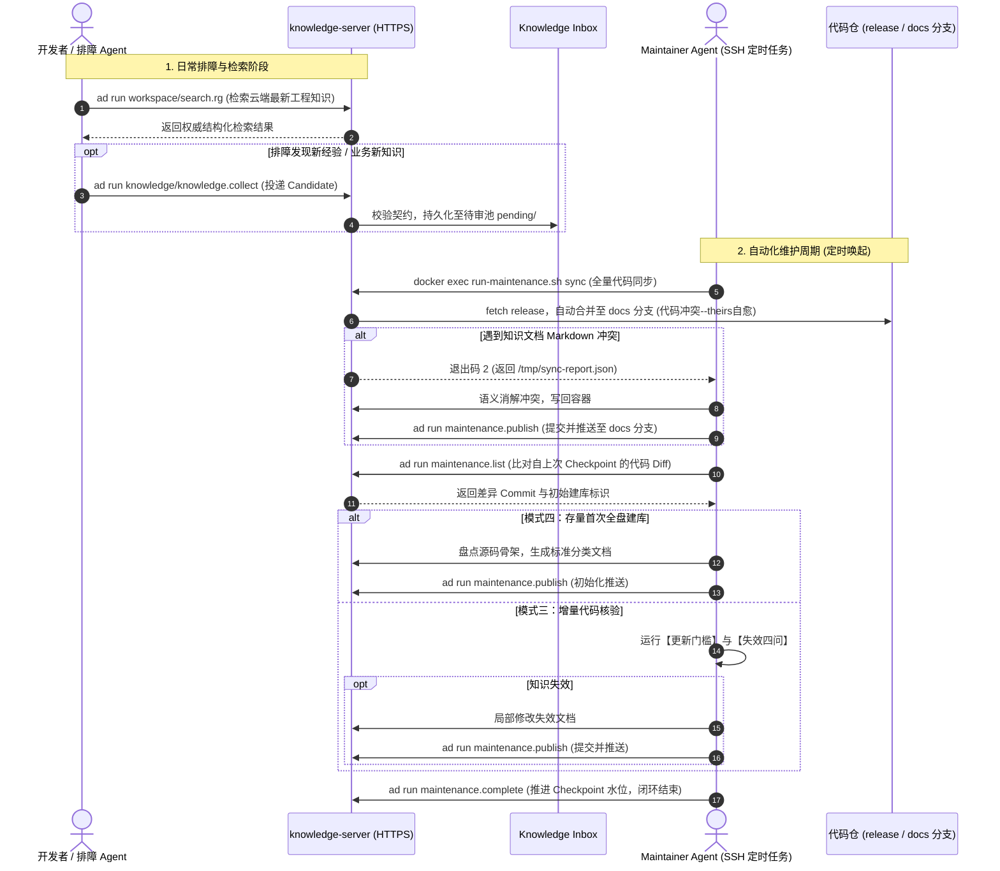

# 知识中枢设计理念与核心架构演进

> 本文以早期设计草案《知识库自动维护与反馈闭环设计》为基石，系统性阐述 **knowledge-server** 的设计哲学、架构权衡与生产演进。

---

## 1. 为什么需要知识中枢？解决什么矛盾？

在基于 AI 编码助手与多 Agent 协作的现代研发体系中，知识库的建设往往面临三个致命矛盾：

1. **“知识维护依赖人工”与“业务迭代高频”的矛盾**：
   传统知识库依赖研发主动书写与手工维护，但业务代码迭代极快，文档从写成的那一刻起就走向过期与腐化。
2. **“本地仓库容易过期”与“排障需要绝对权威事实”的矛盾**：
   开发者或本地 Agent 的本地 Git 分支往往滞后于生产基线（`release`），若依赖本地文档进行生产排障或代码重构，极易产生“基于陈旧假想推导”的严重误判。
3. **“排障经验转瞬即逝”与“正式知识严苛规范”的矛盾**：
   生产排障产生的关键证据链与排查结论极具价值，但要求排障人员立刻按正式知识规范整理成文门槛过高；若直接任其随意落盘，知识库又会迅速沦为混乱、重复且相互矛盾的碎片堆。

为终结上述恶性循环，**knowledge-server** 确立了唯一核心愿景：
> **Git 托管正式知识，云主机提供最新只读视界，代码变更自动闭环核验，人工贡献统一进入 Knowledge Inbox。**

---

## 2. 核心设计哲学

### 原则一：Git 是唯一可信源（Source of Truth），云端是最新只读视界（Read Replica）
- **正式知识代码化**：正式知识全部以 Markdown 格式沉淀于 Git 版本控制中（服务仓采用 `docs` 分支，系统跨仓知识采用 `master` 分支）。所有历史变更可审计、可追溯、可审查。
- **本地不再作为知识权威**：排障与检索一律跨网络读取云主机最新镜像，彻底解决本地环境滞后、漏拉代码导致的知识陈旧；本地仅保留特征代码分析，消灭单机环境差异。

### 原则二：三权分立与严格的安全平面隔离（Tri-Plane Isolation）
为了在对外开放网络服务的同时保障云端资产与执行安全，系统严格划分为三大物理隔离平面：

```text
               客户端 / 排障 Agent / Valet
                           │
       [对外网络暴露面]      │ (HTTPS 443 / 鉴权令牌)
       ────────────────────┼────────────────────────
                           ▼
               ┌───────────────────────┐
               │    knowledge-server   │
               │   (ActionDock Serve)  │
               └───────────┬───────────┘
                           │
           ┌───────────────┴───────────────┐
           ▼                               ▼
     [Read Plane]                   [Feedback Plane]
  knowledge-workspace               knowledge-inbox
  (只读全文检索与浏览)              (结构化候选知识投递)
  * 零写权限、路径逃逸防护           * 仅允许追加，禁止修改删除
       ─────────────────────────────────────────────
       [严格禁止外部暴露]
                           ▲
                           │ (SSH 反向触发 / 本地 Docker)
                           │
             [Privileged Maintenance Plane]
                 knowledge-maintenance
         (双分支代码同步、变更扫描、Checkpoint推进)
```

1. **只读平面（Read Plane - `knowledge-workspace`）**：
   - 暴露 `search.rg`、`files.read`、`files.list`。
   - 彻底剥离一切写能力、移动能力和任意命令执行能力；强制符号链接逃逸检查与凭据脱敏；路径向外部归一化为相对路径，彻底隐藏宿主机真实物理拓扑。
2. **反馈平面（Feedback / Append Plane - `knowledge-inbox`）**：
   - 暴露 `knowledge.collect` 与 `knowledge.list`。
   - 定位为**受控写（Append-Only）**。只接受符合契约的 Candidate Markdown 投递至待审池，客户端无权直接修改或删除正式知识，杜绝越权污染。
3. **特权维护平面（Privileged Maintenance Plane - `knowledge-maintenance`）**：
   - 包含 `maintenance.sync`、`maintenance.list`、`maintenance.publish`、`maintenance.complete`。
   - **铁律：绝对禁止通过 HTTP/HTTPS 端口暴露**。仅允许云端定时任务（Cron / Agent Scheduler）通过 SSH 连入宿主机，使用 Docker CLI 受控唤起。

### 原则三：贡献单元与知识单元彻底解耦（Candidate vs Knowledge）
- **Candidate（贡献单元）**：
  保存于 Knowledge Inbox，承载高时效、强证据属性。包含排障上下文、日志片段、故障 Case、设计提案等。采用 `YAML Frontmatter + 语义标记块（<!-- section:xxx -->）` 强类型约束，保全事实而非思维链。
- **Formal Knowledge（正式知识单元）**：
  沉淀于各仓 `docs/knowledge/`，按六大单数核心分类（`flow`、`module`、`rule`、`interface`、`data`、`runbook`）严格归一。
- **解耦核心**：
  **严禁“一条 Candidate 机械对应一个知识文件”**。Candidate 仅作为原料，由具有深度推理能力的 Maintainer 综合已有文档进行去重、交叉验证、打补丁或重构，避免知识库碎裂。

### 原则四：代码变更驱动自动核验，知识失效才触发更新（Change-Driven Verification）
- **变更只代表需要检查**：业务代码发生 Git 变更（Diff）是触发知识审查的充分条件，但不是修改文档的充分条件。内部重构、未影响对外契约与核心流程的代码调整无需更动文档。
- **审查留痕（Checkpoint 铁律）**：无论最终是否修改文档，Maintainer Agent 在执行完【失效四问】判定后，**必须推进 Checkpoint 水位（`maintenance.complete`）**。这代表“该段代码变更已被知识维护审查覆盖”，使下一次检查能从新的基线出发。

### 原则五：双轨冲突演进（代码自愈 vs 知识消解）
在将生产分支（如 `release`）合并至知识分支（`docs`）时：
- **非知识代码冲突（全自动自愈）**：代码文件的冲突无条件以 `origin/release` 为准（`--theirs` 策略自动合并提交），杜绝编译或代码变更阻塞知识同步；
- **Markdown 知识冲突（保留标记，Agent 语义消解）**：知识文件的冲突蕴含了生产逻辑演化与现有文档记录的事实分歧，脚本保留冲突标记并退出至错误码 `2`，由 Maintainer Agent 执行深度语义对比消解后，统一通过 `maintenance.publish` 提交发布。

### 原则六：零前置依赖的容器化一体发布（All-in-One Distribution）
- 从早期“宿主机安装 Node 环境、分散配置 Cron 脚本”的脆弱设计，彻底重构为基于 Docker Compose 的一体化知识容器。
- 宿主机实现**零前置环境依赖**（免装 Node、免拷脚本、免配置复杂的 sudo 权限），原生监听 HTTPS 443 端口并自带自签名证书自举；所有运维操作收敛为标准容器命令。

---

## 3. 完整流转时序与闭环模型



---

## 4. 架构演进与设计对比

| 核心维度 | 早期草案设想 | 当前生产落地架构 | 演进价值 |
|---|---|---|---|
| **服务分发形态** | 宿主机裸机进程，依赖外部 Cron 调度脚本与本地 Node.js 环境 | Docker Compose 一体化多包容器，自带自举脚本与 HTTPS 服务 | **宿主机零配置**，隔离运行环境，消除依赖与权限隐患 |
| **网络暴露机制** | 简单的 HTTP/外部路由，未对特权操作严格切分 | 原生 HTTPS（端口 443）常驻监听，严格仅暴露 Read/Append 平面 | 对外仅提供安全只读与受控投递，**杜绝网络特权越权风险** |
| **维护平面调用** | 由外部直接执行底层复杂 Git 指令 | 特权平面与网络完全隔离，限定 SSH 连入后执行标准 Docker 工具链 | 屏蔽底层 Git 细碎操作，提供结构化 JSON 契约与操作回滚 |
| **代码冲突处理** | 遇到合并冲突一律人工中断停止 | 智能分流：**非知识代码 `--theirs` 自动自愈**，**知识文档交由 Agent 语义消解** | 日常 95% 的代码合并不再阻断流水线，兼顾鲁棒性与语义精确性 |
| **提交发布体系** | 依赖外部脚本编写多条 `git add`、`commit`、`push` | 内置 `maintenance.publish` 动作，自动校验状态、切换分支并带签名提交 | 消除 Agent 执行底层 shell 命令易错的问题，实现发布标准化 |
| **工作流闭环** | 概念性描述流程步骤 | 明确的状态机定义（退出码 0/1/2、Checkpoint 强制推进机制、四模式切换） | 具备工业级容错与可测试性，适合长时间无人值守运行 |

---

## 5. 总结

`knowledge-server` 不仅仅是一个“文档查看器”，而是一个**能够伴随业务源码持续自主呼吸、自我修正、受控成长的工程知识有机体**：

1. **以只读平面保证当下**：为所有 Agent 与工程师提供零滞后、无污染的生产真实知识视界；
2. **以追加平面捕获未来**：让一线排障与人工实践低成本沉淀，成为知识增长的不竭源泉；
3. **以维护平面守护基线**：以确定性代码变更驱动 AI 深度推理，在 Git 版本控制中构筑坚不可摧的工程资产。
