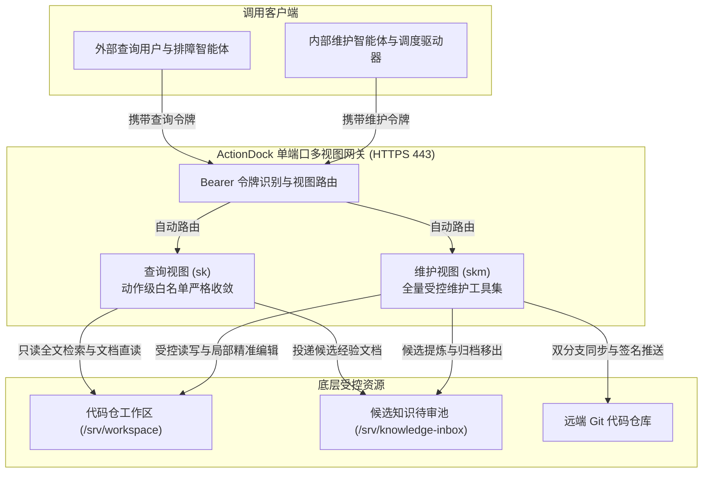
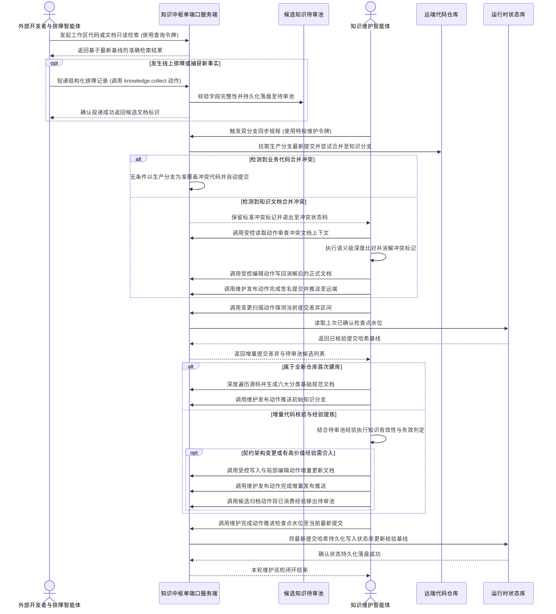

# 知识中枢设计理念与核心架构演进

---

## 为什么传统知识库与本地 RAG 必死

在人工智能赋能软件研发的浪潮中，大模型编程助手与自主智能体已经深入编码、测试与发布流程。然而，制约研发智能体发挥更大价值的核心瓶颈，往往不在于底层模型的推理算力，而在于其获取上下文的事实基准是否存在偏差。长期以来，软件工程团队普遍依赖两类方案试图构建知识基准：一类是以企业内部 Wiki 为代表的传统在线知识库，另一类是基于单机代码切片搭建的本地检索增强生成方案。但在实际生产实践中，这两类方案均无法逃脱失效的必然宿命。

### 企业内部知识库沦为僵尸文档的根因

传统 Wiki 知识库在软件工程实践中，必然陷入创建即巅峰、维护即断崖、演进即失真的单向衰变规律：

- **工程师天生排斥脱离开发上下文的手工写文档流程**：工程师的核心交付目标是业务逻辑、系统稳定性与代码产物。任何脱离终端与集成开发环境、要求切换至独立网页平台或富文本编辑器的知识沉淀流程，都会带来巨大的认知摩擦与上下文切换阻力。在快节奏的迭代周期中，文档编写往往被无限期推迟。
- **文档维护与代码演进天然脱节**：现代业务系统处于高频重构与持续演进之中。接口参数、数据模型、鉴权规则与架构拓扑每周甚至每天都在变化。然而，代码的演化拥有持续集成测试、代码评审与自动化部署流水线严格约束，而外部 Wiki 文档既没有编译器校验，也没有调用链断链告警。代码库持续向前演进，而文档依然停留在系统初建时期的陈旧记忆中。
- **僵尸文档逐渐退化为误导性技术负债**：随着文档与代码实现彻底分裂，Wiki 中积累的大量内容不仅丧失了指导意义，更退化为严重的系统毒药。无论是刚入职的工程师还是接入系统的人工智能智能体，如果遵从了过时的文档指南，往往会调用已经被废弃的接口、配置已经被移除的环境变量，造成严重的决策误判与工时浪费。

### 本地切片检索导致的灾难性人工智能幻觉

为规避传统文档滞后的问题，许多团队转向本地检索增强生成方案，试图直接对本地代码库与文本文件建立向量索引。然而，在多人协同的大型工程场景下，这种单机模式带来了更为致命的人工智能幻觉灾难：

- **本地工作区滞后导致事实基线严重分裂**：本地检索方案的可靠性完全依附于开发者本地机器的同步状态。在实际协同研发中，开发者的本地代码仓库往往因为处于特定特性分支、长期未执行拉取同步，而严重落后于主干生产分支。当本地人工智能智能体基于落后数周甚至数月的本地代码切片构建索引时，其输入大模型的基础事实本身就是错误的。
- **自洽的逻辑推演产生极具欺骗性的虚假方案**：大模型拥有强大的模式识别与语义补全能力。当提供给大模型的事实基准已经过时，大模型并不会报错退出，而是会在过时事实的基础上，以严丝合缝、逻辑自洽的严密推理输出修复代码或实现方案。这种幻觉具有极强的隐蔽性，开发者往往花费数小时甚至数天排查一段针对在生产环境中根本不存在的代码所编写的补丁，引发严重的效能倒退。
- **生硬文本切片破坏工程代码拓扑与语义连贯性**：工程代码资产不是平铺直叙的自然语言段落，而是由类型系统、调用拓扑、依赖注入与模块契约构成的网状结构。通用向量切片粗暴地以固定字符数或固定行数对源码进行物理截断，将类的声明、方法的实现与其上下文契约强行拆散。检索召回的代码碎片缺乏上下游调用语义，大模型只能依靠概率猜测缺失的逻辑，进一步加剧了幻觉的蔓延。

### 线上排障经验随聊天记录沉没的痛点

软件工程中最具实战价值、含金量最高的知识，往往并不存在于前期的设计文档中，而是在应对生产故障、死锁排查与性能调优的实战交锋中凝结而成：

- **黄金排障经验离散沉没于沟通渠道**：在应急故障排查现场，工程师定位底层根因所依赖的日志线索、网络抓包特征、临时止血规程与关键推导逻辑，几乎全部散落在即时通讯群聊、偶发故障工单以及工程师个人本地便签中。
- **知识断层导致团队反复踩坑**：一旦故障恢复、服务告警消除，这些高价值的排障线索便迅速被海量日常消息所淹没。数月之后，当相似的异常现象再次在生产环境暴露时，由于值班人员轮换或记忆遗忘，团队不得不从零开始重新经历漫长痛苦的定位排查链路，付出高昂的重复故障代价。
- **案发现场直接入库引发体系污染**：如果为了防止经验流失，简单要求排障人员在事后将排障记录直接扔进知识库，又会带来另一种灾难。排障现场的记录充满了强时效性与偶发性，包含特定服务器节点、临时时间戳、冗长的未清洗异常堆栈与试错推测。直接将案发现场作为正式文档存储，知识库在短时间内就会充满大量互不关联、格式混乱的碎片垃圾，严重污染知识检索的信噪比。

---

## 核心设计哲学与解题思路

针对传统知识库与本地检索方案的根本缺陷，知识中枢确立了以自动化、代码化与契约化为核心的架构治理哲学，通过严密的因果推演重塑知识资产的沉淀与消费链路。

### Git 仓库作为知识的单一事实源

工程世界最权威、最严密、历经数十年实战检验的资产管理基础设施是版本控制系统。代码即知识，代码仓库是技术系统的唯一事实源：

- **杜绝信息孤岛的必然归宿**：如果允许知识脱离代码版本控制系统独立存在于第三方平台中，无论管理制度多么严密，文档与代码的裂化都是不可避免的物理规律。将知识文档以纯 Markdown 格式直接存放在代码仓库内，让知识与代码共享相同的版本控制生命周期，是实现知识资产可信的唯一根本路径。
- **继承版本控制的完整工程治理能力**：Git 仓库提供了业界成熟的原子提交、变更追踪、分支隔离、拉取请求与同行评审机制。每一篇知识文档的演化过程都具备明确的作者、提交哈希、修改时间与逐行差异对比。文档变更如同代码一样接受严密的质量审查与版本追踪，从根本上消灭了知识黑盒与无法审计的隐患。

### 双分支治理模型与差异化冲突自愈

将知识与代码共存于同一代码仓库，立刻引申出一个核心架构矛盾：若将知识文档直接提交在业务生产分支，频繁的文档巡检与更新将向生产主干注入大量琐碎的文档提交记录，严重干扰生产发布的纯洁性；而在单一分支上同时进行高频的业务迭代与智能体知识维护，极易频繁触发冲突阻断持续集成流水线：

- **生产主干与知识分支物理隔离**：知识中枢确立了严格的双分支治理模型。业务主干分支专注于功能演进与生产发布；代码仓知识文档沉淀于专属的知识分支（例如 `knowledge` 分支）；跨工程的系统级宏观架构知识则集中沉淀于专属系统知识仓的主分支。两者在物理分支上彻底解耦，互不干扰提交历史。
- **业务代码合并冲突以生产分支为准无条件自动自愈**：在维护流程中，知识中枢需要将业务生产分支合并入知识分支，以获取最新的代码事实。在此过程中，对于业务代码与工程配置文件的合并冲突，系统合并策略无条件以生产分支为准，自动采用生产分支版本完成合并提交。因为在业务代码的领域，生产分支具备绝对权威，知识分支绝无篡改业务实现的特权。该机制彻底杜绝了因业务代码冲突阻断自动化维护流水线的问题。
- **知识文档合并冲突由维护智能体执行深层语义消解**：对于 Markdown 知识文档发生的合并冲突，底层合并脚本主动保留标准冲突标记并退出至特定状态码，将控制权移交至具备全局语义理解能力的维护智能体。维护智能体调取冲突上下文，比对新旧知识事实，消除冲突标记并合成逻辑严密的新文档，随后通过标准化发布工具统一提交推送。这一设计既保障了流水线对代码变更的免干预自愈，又确保了知识资产本身的逻辑严整性。

### 检查点推进水位机制与增量闭环

知识中枢由定时巡检驱动执行代码变更检测与知识有效性核验。而在巡检机制的设计推演中，存在一个关乎系统生死的架构命题：为什么哪怕本次代码变更没有导致任何文档被修改，也必须推进检查点水位：

- **代码变更代表核验触发而非知识失效**：在实际工程中，大量代码提交属于内部算法细节微调、变量重命名、单元测试补充、代码风格格式化或偶发修复。维护智能体在拉取这些提交的差异进行深度比对后，得出科学判定：现有知识文档依然准确完备，对外契约与系统架构未受影响，无需调整文档。
- **确立已核验水位避免算力灾难**：如果系统因为没有产生文档修改而不推进检查点，那么在下一次定时巡检触发时，变更扫描器检测到的起点依然是旧的检查点水位。维护系统将不得不重新拉取同一批已经核验过的代码提交差异，重新组织大模型上下文并再次调用推理。随着时间推移，这种重复扫描将形成死循环，导致海量的大模型算力与令牌配额被白白消耗在已知事实的重复审查上。
- **检查点推进是增量闭环的法定凭据**：推进检查点水位向系统庄严确立了一个新的安全基线，宣告截至当前提交哈希的代码变更已经过完整的知识有效性核验。后续巡检只需以该检查点为基准，轻量探测新产生的提交差异，实现了真正的精益增量闭环。

### 贡献单元与知识单元物理隔离

为了彻底解决线上排障经验容易流失与原始记录容易污染知识库的尖锐矛盾，知识中枢确立了贡献单元与知识单元的物理隔离模型：

- **案发现场与规章体系的本质区别**：排障日志与应急排查记录是充满偶发噪声的案发现场；而正式工程知识是指导后续架构设计与协同研发的规章体系。案发现场必须原汁原味、低门槛、零负担地快速保留；规章体系则必须条理清晰、高度内聚、结构统一。如果将案发现场直接当作规章体系，知识库必然崩塌。
- **非阻塞结构化待审池作为贡献平面**：系统提供极简的候选经验投递入口。一线排障人员或排障智能体在处理完线上故障后，无需遵循复杂的文档排版规则，只需通过标准结构化格式投递故障现象、排查线索、关键证据与初步结论。这些记录作为独立的贡献单元保存在待审池中，不直接对外提供只读检索事实，实现零门槛收集与严格隔离。
- **维护智能体提炼归纳归入六大分类**：维护智能体定期消费待审池中的候选贡献。维护智能体调取当前正式知识库与最新代码实现，对候选经验进行去重识别、交叉验证与事实提炼，以打补丁的形式增量修改或重构正式知识文档，将其沉淀至业务流程、架构模块、规则约束、接口契约、数据定义与运维手册六大规范目录中。提炼完成后，智能体将候选文档归档移出待审池。通过这种提炼与补丁机制，零散的案发现场被萃取为高价值的系统规章。

### 原生单端口虚拟视图与动作级白名单隔离

在网络暴露与操作权限的设计推演中，知识中枢必须解决外部调用方只读安全与内部维护智能体特权操作的隔离矛盾：

- **单端口收敛消除网络暴露面风险**：传统方案通常采用多端口隔离（如分别暴露外网查询端口与内网特权端口），这带来了多端口网络暴露、防火墙规则复杂与跨网络穿透的运维风险；而在单一端口内依靠应用层逻辑做大而全的权限判断，极易因参数绕过或过滤漏洞引发越权修改。
- **基于 ActionDock 虚拟视图特性在 443 端口实现细粒度隔离**：系统统一对外提供原生 HTTPS 443 端口服务，依据请求携带的 Bearer 令牌自动分发至完全隔离的虚拟视图沙盒中。
- **面向外部查询用户的检索视图**（视图标识 `sk`）：采用严格的动作级白名单策略收敛，仅暴露工作区全文检索（`workspace/search.rg`）、工作区文档读取（`workspace/files.read`）、工作区目录列表（`workspace/files.list`）以及候选文档投递收集（`knowledge/knowledge.collect`）。该视图在底层完全未挂载任何文件写入、局部编辑、文件删除、文件移动或版本控制工具。外部请求即便遭遇提示词注入或协议挟持，在底层视图中连写动作的物理指针都不存在，杜绝了一切未授权修改或软链逃逸风险。
- **面向内部维护智能体的受控维护视图**（视图标识 `skm`）：由维护智能体持有专属高强度特权令牌方可接入。该视图开放完整的工作区读写、局部精准编辑、状态差异审查、双分支同步与检查点推进等特权动作，使维护智能体能够在标准化、受控的动作边界内自主完成全生命周期的维护闭环。

### 运行时状态持久化作为系统生命线

知识中枢采用全容器化架构交付，而容器本身的执行环境是无状态且随时可被替换重建的。因此，运行时状态持久化构成了整个系统的生命线：

- **状态库承载核心检查点资产**：系统在宿主机数据卷的 `state/` 目录（挂载至容器内部 `/root/.actiondock` 目录）持久化运行 ActionDock 状态库，核心包含全局状态库文件 `global.db` 与运行时数据库文件 `runtime.db`。这两个文件精确记录了所有纳管工程的最新已核验检查点水位、维护锁状态与调度度量数据。
- **检查点丢失引发灾难性全量重头建库**：如果宿主机 `state/` 目录发生丢失或未正确挂载，当容器重启、宿主机维护拉起或镜像版本升级时，系统内部记录的检查点水位将彻底归零。一旦检查点归零，系统在下一次巡检时，将无法识别任何已核验代码基线，从而将包含数万次提交的成熟代码仓库误判为全新未初始化的空仓库。维护智能体将对所有工程的所有源码文件发起灾难性的全量扫描与从头建库，耗尽巨量大模型算力与令牌预算，甚至引发远端分支覆盖与历史重写危机。
- **统一数据卷收敛与容灾备份原则**：系统通过统一的环境变量收敛宿主机持久化目录体系，将状态库、代码工作区、候选待审池、配置文件与日志卷物理隔离并明确持久化，确立了容器可随时销毁重建，而核心状态与知识资产永不丢失的生产级高可用基准。

---

## 业务流转时序

知识中枢串联了外部查询消费、排障经验投递、自动化双分支同步、冲突语义消解、知识有效性核验与检查点推进的完整闭环，其端到端业务流转时序如下：

---

## 架构演进与特性对比

为了直观呈现知识中枢相较于传统手工模式及临时脚本方案的技术跨越，下表从核心设计维度进行了全面对比：

| 评估维度 | 传统手工在线 Wiki | 单机脚本与本地切片 RAG | 知识中枢生产架构 | 架构核心价值 |
|---|---|---|---|---|
| 事实源载体 | 第三方独立知识库平台或富文本网页，与代码库完全分离 | 开发者单机本地磁盘临时文件与本地向量数据库缓存 | Git 代码仓库作为唯一事实源，代码与文档统一版本管理 | 从根本上消除文档孤岛，保证知识资产严格受控与可审计 |
| 事实基线新鲜度 | 严重滞后，文档生命周期呈单向衰退，普遍充斥僵尸信息 | 取决于本地单机代码同步频率，因滞后经常引发大模型虚假方案 | 云端中枢常态化同步生产基线，对外统一提供最新只读视界 | 杜绝单机环境偏差，彻底消灭基于已废弃代码的大模型幻觉 |
| 维护驱动机制 | 依赖研发人员自觉手工编辑，缺乏与代码发布的强约束 | 离线手工执行脚本或全量重新向量化，维护断续无序 | 代码变更自动驱动核验，增量巡检与待审池消费有机协同 | 维护全流程融入持续演化管道，无需人工编写冗余说明书 |
| 冲突处理策略 | 人工在线覆盖或直接产生互相冲突的无序版本页面 | 遇到合并冲突脚本直接崩溃退出，依赖人工介入终端排查 | 业务代码以生产分支为准自动自愈，知识冲突由智能体语义消解 | 保障自动化流水线高可用性，同时确保知识逻辑严密正确 |
| 排障经验流转 | 零散沉没于即时通讯群聊与个人便签，发生同类故障重复踩坑 | 粗暴将案发现场混入向量库，引入海量偶发环境噪声与碎片 | 贡献单元与知识单元物理隔离，待审池缓冲并提炼入六大分类 | 保持极低经验沉淀摩擦力，同时捍卫正式知识高内聚性 |
| 安全与权限隔离 | 粗粒度页面访问控制，缺乏对写操作与特权动作的物理切分 | 本地脚本缺乏安全沙盒约束，容易发生误删除或路径逃逸 | 单端口双视图动作级白名单隔离，查询与特权维护物理受控 | 零公网端口泛滥，杜绝外部越权修改与未授权写入风险 |
| 算力与令牌消耗 | 不涉及大模型算力，但耗费极高的人工排障与文档编写工时 | 每次全量重新分块切片或重复扫描，大模型算力消耗巨大 | 强制检查点水位推进机制，未改文档亦推进水位避免重复扫描 | 确立精准已核验基线，最大限度节约大模型计算资源 |
| 状态持久化机制 | 依赖第三方商业服务稳定性，缺乏工程维度的断点续传 | 无状态记录或仅存在易丢失的临时标记，容灾能力极弱 | 宿主机独立数据卷持久化核心状态库，容器随时可销毁重建 | 检查点基线永不丢失，彻底杜绝误判全新仓库引发建库风暴 |
