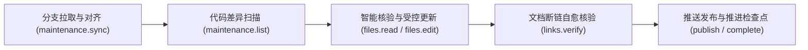

# 知识中枢维护规程与动作参考手册

---

## 维护平面定位与安全隔离

知识中枢采用单端口多视图架构统一收敛至 443 端口运行。面向知识中枢的访问划分为外部查询平面与内部维护平面：

- **外部查询平面**：面向外部调用方与排障人员，通过普通查询令牌路由至受控白名单视图，仅开放只读检索与候选经验投递，坚决杜绝任何写入权限。
- **内部维护平面**：面向受信任的维护智能体与调度系统，通过维护专属特权令牌路由至特权维护视图（配置标识 `skm`），赋予完整的工作区读写、编辑、断链核验、差异审查、双分支同步与检查点推进权限。

维护智能体对云端知识中枢的操作一律通过配置标识 `skm` 发起：

```bash
ad profile add skm -s https://<cloud-host-ip>:443 -t <ACTIONDOCK_AGENT_TOKEN> -k -d "知识中枢特权维护服务"
```

---

## 维护智能体标准五步作业法

维护智能体被调度唤醒后，严格遵循自闭环五步作业流程执行单仓维护：



- **分支拉取与对齐**：调用代码同步动作，将目标代码仓的生产基线分支合并至知识文档分支。业务代码冲突无条件以生产分支为准自动完成自愈提交，若存在知识文档冲突则进入语义消解流程。
- **代码差异扫描**：调用变更扫描动作，比对上一轮检查点水位与当前最新提交之间的差异提交数量与变动文件列表。若无新增提交则直接跳过，避免无效算力开销。
- **智能核验与受控更新**：根据代码差异内容判定是否触及架构事实、对外契约或核心规则。若需修改，优先采用局部精准编辑动作对受影响文档最小化打补丁，杜绝大文本重写导致的上下文丢失。
- **文档断链自愈核验**：文档增删改完成后，调用链接校验动作对整个文档目录进行内链与锚点扫描。若发现因重构或重命名产生的死链，智能体必须就地自愈修复。
- **推送发布与推进检查点水位**：调用发布动作原子化提交并推送到远端知识分支；最后必须调用完成动作推进检查点水位至当前最新提交，确立已核验法定基线。

---

## 远端自省与动作发现机制

维护智能体面对远端受控服务时，无需在提示词中静态硬编码动作参数，可通过 ActionDock 提供的原生自省工具动态探索服务能力：

```bash
# 查看远端服务中已挂载的全部工具包、可用动作及规程概览
ad info --profile skm

# 列出远端所有可用动作清单及其功能描述
ad list --profile skm

# 自省查询特定动作的完整描述、模式定义与传参示例
ad describe workspace/files.edit --profile skm
ad describe maintenance/maintenance.sync --profile skm
```

---

## 核心维护动作场景化实战字典

### 代码分支同步：`maintenance/maintenance.sync`

- **为什么需要它**：确保云端工作区时刻对齐远端真实仓库的最新生产基线，并将代码变动同步合并至知识分支。
- **调用时机**：维护智能体作业的第一步。
- **常用参数**：
  - `path`：可选。指定单仓工作区路径，省略时对所有配置代码仓执行批量同步。
- **调用范例**：
  ```bash
  # 全量同步所有配置仓库
  ad run maintenance/maintenance.sync --profile skm

  # 定向同步指定代码仓
  ad run maintenance/maintenance.sync --profile skm -- path=/srv/workspace/order-service
  ```

### 代码变更扫描：`maintenance/maintenance.list`

- **为什么需要它**：精准计算上一次已核验的检查点水位与当前最新代码之间的提交增量，为智能体提供最小化审查上下文。
- **调用时机**：分支同步完成后的第二步。
- **常用参数**：
  - `path`：可选。指定单仓工作区路径，省略时返回全量多仓扫描列表。
- **调用范例**：
  ```bash
  # 批量扫描所有仓库的代码变更情况
  ad run maintenance/maintenance.list --profile skm

  # 扫描指定代码仓的差异提交与文件列表
  ad run maintenance/maintenance.list --profile skm -- path=/srv/workspace/order-service
  ```

### 工作区文件读写与受控编辑

- **为什么优先使用局部受控编辑**：全量重写大文本（`files.write`）极易引发大模型截断、幻觉遗漏或格式破坏；局部受控编辑（`files.edit`）基于旧文本块做唯一精准替换，确保最小化受控变更。
- **核心动作清单**：
  - **文件分段直读**：`workspace/files.read`
    ```bash
    ad run workspace/files.read --profile skm -- path=order-service/docs/api.md startLine=1 maxLines=100
    ```
  - **局部受控精准编辑**：`workspace/files.edit`
    ```bash
    ad run workspace/files.edit --profile skm -- path=order-service/docs/api.md targetContent="timeout: 3000" replacementContent="timeout: 5000"
    ```
  - **全量安全写入**：`workspace/files.write`（通常仅在新建文档或初始化建库时使用）
    ```bash
    ad run workspace/files.write --profile skm -- path=order-service/docs/new-module.md content="# 新模块架构说明\n..."
    ```

### 文档断链与引用校验：`workspace/links.verify`

- **为什么需要它**：文档重构、重命名或段落调整极其容易导致相对路径文件链接或标题锚点失效。人工肉眼排查极其耗时，通过自动化确定性校验可杜绝死链。
- **调用时机**：在完成文档增删改之后、提交发布之前必须执行。
- **调用范例**：
  ```bash
  ad run workspace/links.verify --profile skm -- path=/srv/workspace/order-service
  ```

### 工作区变更审查：`workspace/git.status` 与 `workspace/git.diff`

- **为什么需要它**：维护智能体在执行发布前必须自检，确保本次改动仅包含文档目录（如 `docs/`），坚决防止误改业务代码或遗留临时垃圾文件。
- **调用时机**：发布前最后的安全审查门禁。
- **调用范例**：
  ```bash
  # 审查工作区文件修改状态
  ad run workspace/git.status --profile skm -- path=/srv/workspace/order-service

  # 审查变更差异统计摘要
  ad run workspace/git.diff --profile skm -- path=/srv/workspace/order-service -- statOnly:=true
  ```

### 文档发布推送与检查点推进

- **发布动作**：`maintenance/maintenance.publish`
  - **说明**：自动将文档分支改动暂存、签名提交并推送到远端仓库。
  - **调用范例**：
    ```bash
    ad run maintenance/maintenance.publish --profile skm -- path=/srv/workspace/order-service message="docs: update payment timeout contract"
    ```
- **推进检查点动作**：`maintenance/maintenance.complete`
  - **说明**：无论本次代码差异是否导致文档更新，流程结束时均必须调用此动作推进检查点，记录已核验基线。
  - **调用范例**：
    ```bash
    ad run maintenance/maintenance.complete --profile skm -- path=/srv/workspace/order-service commit="<TO_COMMIT>" actionTaken="docs_updated" summary="更新了支付超时契约说明"
    ```

---

## 候选知识管理与待审归档

排障人员投递的排障经验保存在待审池中。维护智能体在完成知识提炼后，需对候选文档执行归档：

```bash
# 查看待审池中的候选知识清单
ad run knowledge/knowledge.list --profile skm

# 提炼融合后将候选文档归档
ad run knowledge/knowledge.archive --profile skm -- path=2026-09-26-order-timeout.json reason="已提炼合并至 payment 手册"
```

---

## 智能体编排技能对接

在定时调度任务或工作流引擎中，直接挂载配套技能 [skills/knowledge-maintenance-orchestrator/SKILL.md](file:///root/code/knowledge-server/skills/knowledge-maintenance-orchestrator/SKILL.md)，以极简指令唤醒智能体即可自主完成闭环：

```text
请激活 【knowledge-maintenance-orchestrator】 技能，针对指定的单一仓库执行一轮知识维护闭环。
```
