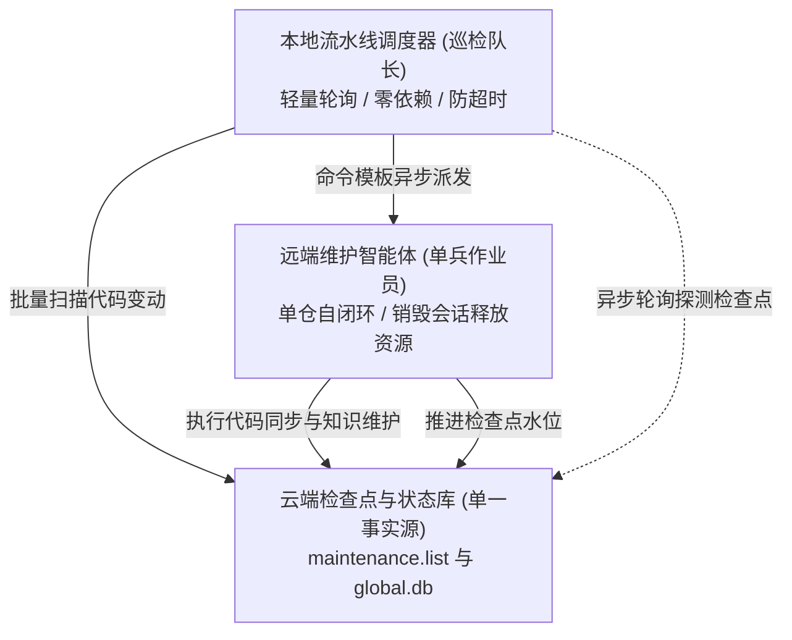

# 本地多仓流水线调度器使用手册

---

## 为什么需要批量流水线调度器

当团队只有一个代码仓时，手动或定时单次触发智能体维护即可轻松搞定。但当团队进入微服务与中台架构，纳管 50 至 100 个以上代码仓时，传统的维护方式会遭遇以下核心瓶颈：

- **长链路上下文急剧膨胀**：如果由单一宏观主智能体串行维护 100 个仓库，跨越数十个仓库的多轮对话历史、代码差异比对与长链路会话会导致智能体上下文窗口瞬间打满，引发严重的注意力漂移与决策精度衰退。
- **长时间长连接极度脆弱**：大规模批量巡检通常耗时数十分钟甚至数小时。若依赖单一长连接维持会话，中途网络偶发抖动、网关超时断开，整条流水线就会瞬间瘫痪且无法恢复。
- **状态维护脆弱与耦合**：如果在本地维护复杂的账本文件或在智能体提示词中硬编码多仓循环，单个仓库失败往往会引发级联错误，中断整体批次任务。

---

## 巡检队长与单兵作业员的解耦哲学

针对大规模多仓场景，knowledge-server 确立了调度器与执行智能体极致解耦的心智模型：



- **本地调度器是「巡检队长」**：
  - 只负责宏观确定性调度，不调用大模型，不产生长上下文。
  - 像巡检队长一样，按清单挨个扫描远端仓库基线，发现有变动就派发任务，并定期探测检查点是否推进。
- **维护智能体是「单兵作业员」**：
  - 每次被唤醒仅承接单一目标代码仓，专注在当前代码差异与架构文档中。
  - 完成自愈闭环与检查点推进后，立即销毁当前会话，资源彻底回收，杜绝上下文累积污染。
- **云端检查点是唯一法定事实源**：
  - 调度器与维护智能体之间完全无需维护任何易漂移的本地账本文件。
  - 已经完成检查点推进的仓库自动判定为无变更并跳过；中途断网、强行中止退出后再次启动，自动从上次未完成的仓库接着跑，天然支持断点续传。

---

## 核心特性

- **原生轻量零依赖**：基于原生 Node.js 内置模块编写，无需安装任何第三方 npm 依赖包，开箱即用。
- **开放式派发命令模板**：通过 `--dispatch-cmd` 参数接收任意外部派发命令模板，内置模板引擎自动安全替换占位符，无缝兼容各类智能体运行时、接口调用与命令行工具。
- **天然单一事实源断点续传**：直接读取云端 ActionDock 状态库检查点水位，彻底消除双事实源与状态漂移隐患。
- **异步状态侦听与防卡死保护**：派发任务后以非阻塞机制脱离，定期探测远端检查点推进状态，同时具备单仓最大等待超时保护，杜绝死锁卡死流水线。
- **动态终端看板与结算报告**：终端看板原地动态刷新，实时呈现进度条、总体指标、当前活跃仓与耗时，执行完毕输出结构严整的 Markdown 结算报告。

---

## 模板引擎占位符字典

在 `--dispatch-cmd` 命令模板中可使用以下占位符，执行时将根据远端扫描结果自动安全替换：

- **仓库标识**：`{{repo}}`
  - 对应代码仓名称（例如 `order-service`）。
- **工作区路径**：`{{path}}`
  - 远端工作区绝对路径（例如 `/srv/workspace/order-service`）。
- **目标分支**：`{{branch}}`
  - 目标分支名称（例如 `release` 或 `master`）。
- **前置检查点**：`{{from}}`
  - 前置检查点提交哈希，首次建库时取值为 `initial`。
- **目标检查点**：`{{to}}`
  - 目标最新提交哈希，对应仓库当前最新 HEAD 提交。
- **待核验提交数**：`{{commitCount}}`
  - 待核验的新增提交总数。
- **变动文件总数**：`{{changedFilesCount}}`
  - 代码差异涉及的变动文件总数。
- **变动统计摘要**：`{{diffSummary}}`
  - 文件变动统计摘要文本。
- **提交日志摘要**：`{{commitsSummary}}`
  - 格式化的提交日志摘要文本。
- **指导语模板**：`{{prompt}}`
  - 开箱即用的专业单仓维护指导语模板，包含目标基线、工作区绝对路径、更新门槛判定与检查点推进门禁等结构化提示词资产。

模板引擎在替换占位符内容时默认启用安全转义，自动对反斜杠与双引号进行转义处理，防止 Shell 语法截断或注入异常。

---

## 命令行参数选项一览

- `--profile <name>`：ActionDock 远端客户端配置标识，默认值为 `skm`。
- `--dispatch-cmd <template>`：用户自定义派发命令模板，支持全量占位符。
- `--timeout <minutes>`：单仓最大等待检查点推进超时时间（分钟），默认值为 15。
- `--interval <seconds>`：侦听远端检查点轮询探测间隔（秒），默认值为 10。
- `--dry-run`：预演模式，仅扫描远端变更并打印各仓库替换后的派发命令，不实际触发派发与轮询。
- `--only <repos>`：仅处理指定的单个或几个仓库（逗号分隔，例如 `order-service,cron-service`）。
- `--report-file <path>`：最终 Markdown 结算报告输出路径，默认值为 `maintenance-report.md`。
- `-h, --help`：打印完整帮助信息与占位符列表。

---

## 多形态派发实战场景范例

### 场景一：ActionDock 异步动作派发

通过 ActionDock 异步动作触发远端维护智能体：

```bash
./bin/pipeline-runner.mjs \
  --profile skm \
  --dispatch-cmd 'ad run my-agent.dispatch --profile skm --async -- repo="{{repo}}" path="{{path}}" prompt="{{prompt}}"'
```

### 场景二：Webhook HTTP 接口派发远程智能体

通过网络接口触发远程智能体集群执行单仓维护：

```bash
./bin/pipeline-runner.mjs \
  --profile skm \
  --dispatch-cmd 'curl -s -X POST https://agent.internal/api/dispatch -H "Content-Type: application/json" -d "{\"repo\": \"{{repo}}\", \"to\": \"{{to}}\"}"'
```

### 场景三：本地命令行派发

调用本地已安装的智能体命令行工具（例如 lobster）：

```bash
./bin/pipeline-runner.mjs \
  --profile skm \
  --timeout 20 \
  --interval 15 \
  --dispatch-cmd 'lobster run maintainer --repo="{{repo}}" --to="{{to}}" --prompt="{{prompt}}"'
```

### 场景四：预演模式检查派发命令

在正式批量运行前，先进行预演比对，检查命令参数替换是否符合预期：

```bash
./bin/pipeline-runner.mjs --dry-run
```

### 场景五：定向处理指定仓库

仅对特定发生紧急故障或变更的单个代码仓执行维护：

```bash
./bin/pipeline-runner.mjs \
  --only order-service \
  --dispatch-cmd 'ad run my-agent.dispatch --profile skm --async -- repo="{{repo}}" prompt="{{prompt}}"'
```

---

## 执行观测与结算报告产物

- **动态终端看板**：调度器运行期间在终端原地刷新，清晰展示总仓数、已完成仓数、已跳过仓数、当前活跃仓名称、单仓耗时与全局总耗时。
- **Markdown 结算报告**：批次任务结束后在当前目录生成 `maintenance-report.md`，汇总每个仓库的处理结果、代码增量区间、耗时与错误详情，作为版本审计与合规留存资产。
