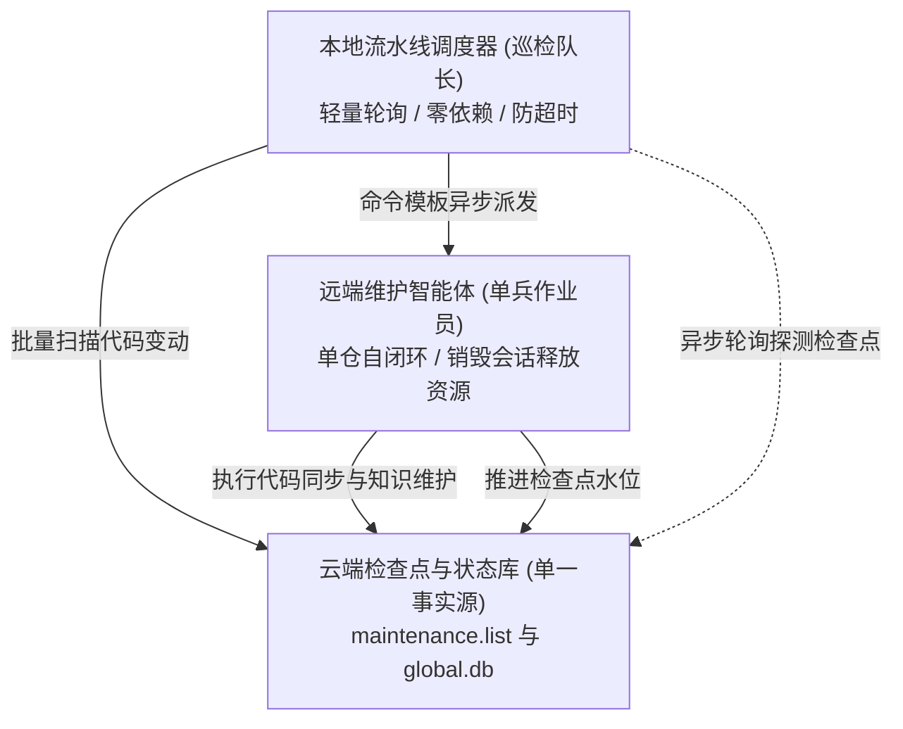

# 本地多仓流水线调度器使用手册

---

## 解决的问题

单仓维护可直接触发智能体完成；但当微服务仓库达到数十甚至上百个时，传统的长链路串行维护面临以下问题：

- **会话上下文溢出**：多仓连续对话会导致智能体上下文窗口打满，推理精度显著下降。
- **长连接脆弱**：批量巡检耗时较长，网络抖动或网关超时容易中断批处理。
- **状态维护脆弱**：本地账本容易与远端真实代码产生状态漂移。

---

## 解耦模型：队长与作业员



- **本地调度器（巡检队长）**：只负责按清单批量扫描、派发任务并轮询检查点是否推进，不跑大模型，零长会话开销。
- **维护智能体（单兵作业员）**：被唤醒后只专注当前单一仓库，完成自闭环后销毁会话释放资源。
- **天然断点续传**：以云端检查点为唯一事实源。中途随时退出或断网，再次运行自动跳过已完成仓库。

---

## 模板引擎占位符字典

在 `--dispatch-cmd` 模板中可使用以下占位符（执行时会自动进行安全引号转义）：

- `{{repo}}`：仓库名（例如 `order-service`）。
- `{{path}}`：远端工作区绝对路径（例如 `/srv/workspace/order-service`）。
- `{{branch}}`：目标分支名。
- `{{from}}`：前置检查点提交哈希（首次建库为 `initial`）。
- `{{to}}`：目标最新提交哈希。
- `{{commitCount}}`：待核验的新增提交总数。
- `{{changedFilesCount}}`：变动文件总数。
- `{{diffSummary}}`：变动统计摘要文本。
- `{{commitsSummary}}`：提交日志简短列表。
- `{{prompt}}`：开箱即用的专业单仓维护指导语模板。

---

## 命令行选项一览

- `--profile <name>`：客户端配置标识，默认 `skm`。
- `--dispatch-cmd <template>`：自定义派发命令模板（预演模式可选，运行时必填）。
- `--timeout <minutes>`：单仓最大等待超时（分钟），默认 15。
- `--interval <seconds>`：远端检查点轮询探测间隔（秒），默认 10。
- `--dry-run`：预演模式，仅扫描远端变更并打印替换后的派发命令。
- `--only <repos>`：仅处理指定的仓库（逗号分隔，如 `order-service,cron-service`）。
- `--report-file <path>`：结算报告输出路径，默认 `maintenance-report.md`。
- `-h, --help`：打印帮助信息。

---

## 实战调用范例

### ActionDock 异步动作派发

```bash
./bin/pipeline-runner.mjs \
  --profile skm \
  --dispatch-cmd 'ad run my-agent.dispatch --profile skm --async -- repo="{{repo}}" path="{{path}}" prompt="{{prompt}}"'
```

### HTTP 接口派发远程智能体

```bash
./bin/pipeline-runner.mjs \
  --profile skm \
  --dispatch-cmd 'curl -s -X POST https://agent.internal/api/dispatch -H "Content-Type: application/json" -d "{\"repo\": \"{{repo}}\", \"to\": \"{{to}}\"}"'
```

### 本地智能体命令行派发

```bash
./bin/pipeline-runner.mjs \
  --profile skm \
  --timeout 20 \
  --interval 15 \
  --dispatch-cmd 'lobster run maintainer --repo="{{repo}}" --to="{{to}}" --prompt="{{prompt}}"'
```

### 预演模式（预览命令替换）

```bash
./bin/pipeline-runner.mjs --dry-run
```

### 定向维护指定仓库

```bash
./bin/pipeline-runner.mjs \
  --only order-service \
  --dispatch-cmd 'ad run my-agent.dispatch --profile skm --async -- repo="{{repo}}" prompt="{{prompt}}"'
```

---

## 执行观测与结算报告

- **终端看板**：原地动态刷新，实时呈现进度条、总仓数、已完成/跳过数、当前活跃仓与耗时。
- **结算报告**：运行结束后在当前目录生成 `maintenance-report.md`，汇总各仓库处理结果与错误信息。
