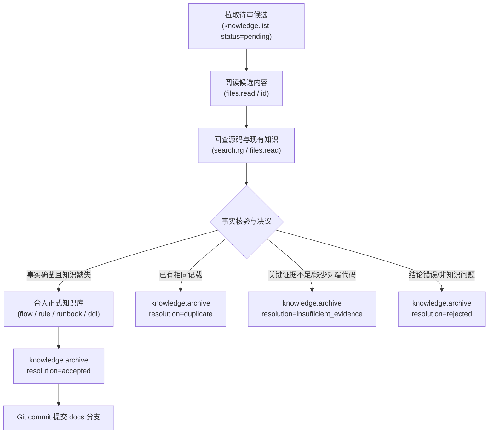

# Knowledge Inbox 消费与审核规程

Knowledge Inbox 是所有排障经验、人工补充与修正建议进入正式知识库前的缓冲池。本规程指导维护智能体运行在云主机或高权限会话中，对待审候选文档进行审核、消歧、去重、合入正式知识库并推进归档。

---

## 核心设计与合并铁律

- **候选文档是贡献单元，不是知识存储单元**：
  - 严禁机械地“一条候选文档新建一个知识文件”。
  - 候选文档必须被消化并合入到现有规范文档（`flow/`、`rule/`、`runbook/`、`data/`、系统层业务域、或 `ddl/` 语义补丁）中。
- **严守布局与命名规范**：
  - 所有合入动作严格遵守 [layout.md](layout.md)（六大单数类别目录：`flow`、`module`、`rule`、`interface`、`data`、`runbook`，统一 `{kind}-{topic}.md` 命名）。
- **以最新代码与现有文档为准**：
  - 候选文档中记录的结论必须回查代码（利用 `search.rg` 或本地源码）核验，防止引入过时、错误或仅限特定测试环境的偏颇结论。
- **必须完成归档闭环**：
  - 每篇候选文档处理完成后，必须调用 `knowledge.archive` 给出明确决议（`accepted`、`duplicate`、`insufficient_evidence`、`rejected`），确保 `pending/` 待办池不积压。

---

## 审核消费标准流程



### 扫描待处理候选文档
调用 `actiondock-knowledge-inbox` 的 `knowledge.list`（挂载 `--profile skm`）：
```bash
ad run knowledge.list --profile skm -- status="pending"
```
出参返回 `items` 数组，包含每个待审文档的 `id`、`filename`、`title`、`domain`、`tags`、`createdAt` 等。

### 阅读候选内容并核查代码
- 使用 `files.read --profile skm` 查看候选文档完整 Markdown 正文；
- 提取候选文档中的证据链（类、方法、日志特征、表名、配置项）；
- 使用 `search.rg --profile skm` 在相关工程中核验该逻辑是否真实存在且为当前最新分支逻辑；
- 查阅目标仓或系统域当前的知识文档，评估该知识是否已被覆盖。

### 决议流转与归档

#### 采纳合入（accepted）
- **判定标准**：事实准确、代码已确证、在当前知识库中确实存在缺口。
- **合入目标选择**：
  - **排障手段与错误码**：优先合入对应仓的 `runbook/runbook-{topic}.md`，或在对应 `flow/flow-{topic}.md` 的失败传播链/排查指引中补充。
  - **主干流程与分支**：补充或修正对应仓或系统层业务域的 `flow/flow-{topic}.md` 与 `overview.md`。
  - **公共规则与约束**：合入 `rule/rule-{topic}.md`。
  - **数据库字段语义勘误**：合入系统层 `ddl/data-ddl-{schema}.md` 的 `## 字段语义补丁` 节（格式：`|表|字段|正确语义|依据|`）。
- **执行归档**：
  ```bash
  ad run knowledge.archive --profile skm -- id="<id>" resolution="accepted" note="已合入 <目标文档相对路径>"
  ```

#### 重复候选（duplicate）
- **判定标准**：候选文档记录的事实、错误码或规则，在现有知识库中已有完整且准确的记载。
- **执行归档**：
  ```bash
  ad run knowledge.archive --profile skm -- id="<id>" resolution="duplicate" note="与现有文档 <目标文档> 重复"
  ```

#### 证据不足（insufficient_evidence）
- **判定标准**：排查结论存在大段未确认事项（unknowns）、缺少对端工程源码无法闭环推断、或属于偶发网络/硬件抖动无法复现。
- **执行归档**：
  ```bash
  ad run knowledge.archive --profile skm -- id="<id>" resolution="insufficient_evidence" note="缺少对端系统源码核实，暂不入库"
  ```

#### 拒绝采纳（rejected）
- **判定标准**：属于个人开发环境特有失误、已废弃过时的历史遗留逻辑、或经查证与源码事实相悖。
- **执行归档**：
  ```bash
  ad run knowledge.archive --profile skm -- id="<id>" resolution="rejected" note="经核对源码为废弃接口，无需入库"
  ```

### 正式知识库提交
完成所有 `accepted` 候选的文档合入后：
- 核对修改的文件均符合 [layout.md](layout.md) 与 [metadata.md](metadata.md)；
- 运行 `git diff` 检查改动精度，杜绝无关格式变化；
- 执行 `git commit`（如 `docs: merge knowledge inbox candidates (KB-xxx)`）并推送到远端知识分支。
