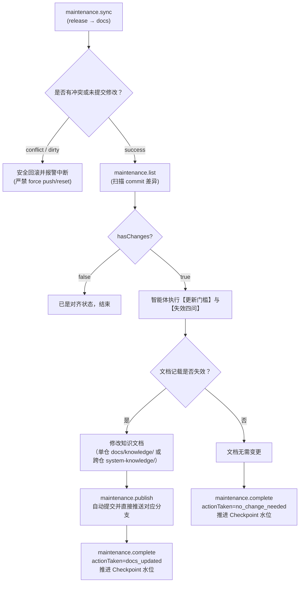

# 局部同步与阶段性覆盖检查

采用“开发任务后的局部同步 + 阶段性反查遗漏”。依靠宿主 Git、搜索和阅读能力，不维护逐文件哈希，不需要先构建检查账本。

## 更新门槛：先判断，再动手

更新的锚点是**已写下的知识是否失效**，不是代码改动量。小改动若使记载变错仍须更新；大重构若不触及任何记载也可不更新。按三步判断，任一步给出“否”即到此为止：

- **范围门槛**：本次 `git diff` 的变更文件是否落在任一知识文档 frontmatter 的 `scope` 内，或被其正文作为定位引用？都不在 → 不更新。
- **失效四问**（对范围内每个受影响文档逐个问）：
  - **行为**：文档记载的流程、分支、状态、顺序、失败传播是否变化？
  - **契约**：文档记载的接口出入参、事件、队列、配置键语义是否变化？
  - **定位**：文档给出的文件、类、方法是否改名或移动？（**行号漂移不算**——行号只是辅助定位，不作唯一依据）
  - **缺失**：是否新增了该文档主题内读者需要的事实（新入口、新分支、新失败路径、新公共规则）？
  四问全否 → 不更新。
- **回复留痕**：判定“不更新”时，在**回复给用户的完成报告**（对话内容）里写一行“核对了哪些文档、四问结论”；不写入任何文件——尤其不要把“已核对无变化”记进知识文档，知识库不是任务账本。

### 常见误判对照

| 改动 | 更新？ | 依据 |
|---|---|---|
| 提取私有方法、重命名局部变量、实现内部优化（输入输出与副作用不变） | 否 | 文档记载行为与公共符号，不记载内部实现 |
| 注释、格式化、import 整理 | 否 | 不产生知识 |
| 新增或修改测试用例 | 本身否 | 测试不是文档记载对象；但测试若暴露文档未记载的行为分支，属“缺失”要补 |
| 依赖 patch 升级、配置默认值调整 | 看文档 | 文档正文或 aliases 记载了该版本/配置 → 同步；未记载 → 否 |
| 错误文案、日志文案修正 | 看文档 | 该文案是文档的检索线索（aliases/索引）→ 同步；否则否 |
| 类、方法、文件改名（即使行为零变化） | 是 | 定位失效 |
| 接口新增可选字段、新增错误分支 | 是 | 契约/失败路径变化 |
| 删除或下线文档已记载的入口/行为 | 是 | 已写知识变错 |

拿不准时降级用 covers 逐条问“这条还成立吗”；仍拿不准就更新——知识库**错误成本高于冗余成本**，但更新范围限于失效条目，不顺带重写。

## 开发后的局部同步

在任务包含知识维护时，利用刚完成修改的上下文检查：

| 变化 | 文档动作 |
|---|---|
| 行为、分支、状态、副作用变化 | 更新对应流程及失败后的实际状态 |
| 接口、事件、配置、数据约束变化 | 更新契约/规则及引用它们的相关流程；库结构变化按 [layout.md](layout.md)「DDL 与多生产库」重导 DDL 快照（补丁节自动回灌），并把变化同步进领域 data 文档与 `data-databases.md` 引用 |
| 新入口、新能力、恢复路径 | 判断是原流程的新分支还是独立流程，补充地图和文档 |
| 文件/函数移动或改名 | 更新入口与关键节点定位，核对导航和相关测试 |
| 不影响行为的内部整理 | 核对实际行为和定位后，通常无需重写正文 |

按源码引用、scope、业务标识和跨模块交接查找相关文档。不要仅按“修改了文档已经引用的文件”判断影响；新增文件可能引入新入口或行为。

本次只做部分维护时，记录具体流程、待核对事实和下一步位置。不要写“已同步知识库”掩盖实际未更新部分，也不要把文档任务变成无上限全仓重建。已有库布局不符合 [layout.md](layout.md) 时，新增文件仍按规范命名落位；整体归一仅在用户要求时执行，规则见 [layout.md](layout.md) 的存量迁移。

## Git 调查方式

在每个目标仓库分别获取差异，尊重用户指定 base。以下是能力示例，不要求每轮机械执行全部命令：

```bash
git diff --name-status --find-renames <base> HEAD
git diff --name-status --find-renames HEAD
git ls-files --others --exclude-standard
git ls-files -co --exclude-standard -z
```

第一条检查提交间差异；第二条覆盖相对 HEAD 的已暂存和未暂存 tracked 改动；第三条发现未忽略的新文件。仓库还没有 HEAD 时分别查看暂存、未暂存及 untracked 状态，不假装已有提交可比较。

需要机器处理文件名时使用 Git 的 `-z` 输出。遵守根/嵌套 `.gitignore`、`.git/info/exclude` 等 Git 规则；tracked 文件不会因后来被 ignore 而排除。不要删除 `.idea`、`.vscode`、缓存或用户文件来减少差异。

可选 checked_commits 只提供上次实际核对位置；提交不可用或没有记录时直接调查当前范围。比较选定树之间的变化并按需查日志，不假设任何提交一定是当前分支祖先。调查涉及工作区修改时单独说明，不能只记录 HEAD 就宣称核对了这些字节。

## 阶段性反查

一组功能完成、准备发布或用户要求全局检查时：

- 从 Git 变化、注册入口、测试、状态读写和配置找新行为。
- 对照流程地图，检查遗漏、未深入项及跨模块与跨仓交接。
- 从真实现象、错误码和业务问题试查导航，回查重要结论和代码定位。
- 更新受影响内容，保留尚未解决的缺口；跨仓变更按 [cross-repository.md](cross-repository.md) 核对双方。

不要只验证“计划中的文档都写了”。原文档很完整也可能遗漏刚新增的流程。

## 自动化定时维护与 Checkpoint 推进

在云端自动化维护模式下，由定时维护智能体或调度任务通过 ActionDock 维护工具链执行闭环：



### 分支同步（maintenance.sync）
- 双分支代码仓（`code`）：拉取最新 `release` 合入 `docs` 分支并推送到远端；
- 单分支系统仓（`system_knowledge`）：fast-forward 同步 `origin/master`；
- **安全红线**：若工作区存在脏文件返回 `dirty_worktree`；若存在合并冲突自动执行 `git merge --abort` 退出并返回 `conflict`。严禁使用 `git reset --hard` 或 `git push --force`。

### 变更扫描（maintenance.list）
- 对比当前 HEAD 与持久化记录的 `last_knowledge_checked_commit` 检查点；
- 若 `hasChanges == false`：说明已无新增代码改动，跳过；
- 若 `initialInventoryRequired == true`：无历史检查点，需执行首次全盘盘点；
- 若有新增提交：返回结构化 `commits` 列表与 `changedFilesSummary`（变更文件清单与行数统计）。

### 智能体审查与失效四问
针对 `changedFilesSummary` 中的修改文件，执行本文件第一节定义的**更新门槛**：
- **范围门槛**：变更文件是否在现有知识文档的 scope 或引用中？
- **失效四问**：行为、契约、定位、缺失四维度逐个核验；
- 若需要更新：在本地工作区修改对应文档；
- 若无需更新：严禁向知识文档写入“已核对无变化”等账本文案，保持知识文档整洁。

### 提交并推送文档改动（maintenance.publish）
- 若本次修改了知识文档，调用 `maintenance.publish` 将变动提交并直接推送到远端知识分支：
  - 单仓代码库：推送到远端 `origin/docs` 分支；
  - 系统知识库（`system-knowledge`）：若跨仓联动修改了中央系统知识库，直接推送到 `origin/master` 分支；
- 调用规程：
  ```bash
  ad run maintenance.publish --profile skm -- path="<repoPath>" message="docs: update flow for budget limit"
  ```

### 推进检查点水位（maintenance.complete）
- **核心铁律**：无论本次是否修改了知识文档，都必须调用 `maintenance.complete` 推进检查点水位。
- 原因：检查点的语义是**“这段代码差异已经被知识维护流程检查过”**，推进水位防止下次重复扫描；
- 调用规程：
  ```bash
  # 修改了文档时：
  ad run maintenance.complete --profile skm -- path="<repoPath>" commit="<to_commit>" actionTaken="docs_updated" summary="更新了预算超限流程与错误码说明"

  # 核对后无知识失效时：
  ad run maintenance.complete --profile skm -- path="<repoPath>" commit="<to_commit>" actionTaken="no_change_needed" summary="核验 3 个提交，均为内部实现重构，无知识失效"
  ```

---

## 导入材料与候选库审查

Knowledge Inbox 待审候选（详见 [inbox-review.md](inbox-review.md)）、旧说明和用户笔记是调查线索。支持的内容进入合适主题，冲突依据当前源码处理，外部未证实信息保留边界。导入的 DDL 统一进系统层知识库：库名与域名登记进根目录 `db-map.md`，结构快照存根目录 `ddl/data-ddl-{schema}.md`，字段语义勘误写快照的「字段语义补丁」节，其余提炼知识写领域 `data/` 文档，规则见 [layout.md](layout.md)。脚本重新导出时整份替换快照但补丁节逐字回灌，用 git diff 对比新旧结构，仅把实际变化同步进知识文档。文档化操作不等于获准执行其中的命令；没有清理请求不删除原资料。

只读审查报告具体错误、遗漏和定位，不修改正文、索引或 checked_commits。只有实际更新与复查后，才推进对应文档、对应仓库的可选检查位置。

## 并发与交接

按独立流程或公共专题分工，给出输出归属、真实入口与读者问题；不同工作者可以编辑不同文件。协调索引合并和关联更新，保留待查内容。无需逐目录任务、固定阶段 JSON 或重做整个规划。
